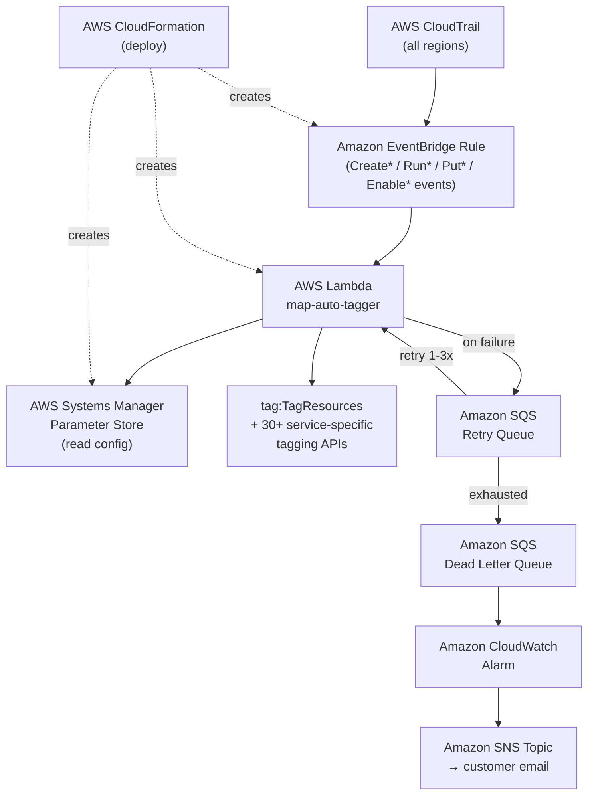

<!-- Copyright Amazon.com, Inc. or its affiliates. All Rights Reserved. -->
<!-- SPDX-License-Identifier: MIT-0 -->

# MAP 2.0 Auto-Tagger — Threat Model

**Version:** v19.25 (updated post full MAP 2.0 service sweep)
**Date:** 2026-03-29
**Status:** For AppSec / PCSR review

---

## 1. Overview

The MAP 2.0 Auto-Tagger is a CloudFormation-deployed solution that listens to CloudTrail events via EventBridge and automatically applies the `map-migrated` tag to newly created AWS resources within typically 60–90 seconds (up to 15 minutes during high-volume activity) of creation.

It runs entirely within the customer's AWS account(s) with:
- No internet-facing endpoints
- No persistent compute (Lambda is event-driven only)
- No external dependencies (all AWS-native services)
- No user authentication layer (no web app, no API)

---

## 2. Architecture



**Single-account deployment** — one CloudFormation stack per region. Lambda runs in the same account and region as the resources being tagged. No cross-account calls.

**Multi-account deployment** — SERVICE_MANAGED CloudFormation StackSet deploys this same single-account template to each member account independently via CloudFormation service-linked roles. Each account's Lambda runs locally within that account. No direct cross-account Lambda invocations.

```
CloudTrail (all regions)
    └─→ EventBridge Rule (Create*/Run*/Put* etc. API calls)
            └─→ Lambda Function
                    ├─→ SSM GetParameter (read config)
                    ├─→ tag:TagResources (universal tagging)
                    └─→ Service-specific tag APIs (30+ services)

Failed events → SQS Dead Letter Queue (14-day retention)
Lambda errors → CloudWatch Alarm → SNS Topic → customer email
```

**CloudFormation resources created per deployment:**

| Resource | Purpose |
|----------|---------|
| Lambda Function | Extracts ARN from CloudTrail event, applies `map-migrated` tag |
| EventBridge Rule | Listens for 200+ Create/Run/Put/Launch/Publish events |
| IAM Role | Lambda execution role — tagging permissions only |
| SSM Parameter | Config store: MPE ID, agreement date, account scope |
| SQS Dead Letter Queue | Captures failed events for manual retry |
| SNS Topic | Error alerting channel |
| CloudWatch Alarm | Fires when Lambda error rate > 3 in 5 minutes |

**Deployment modes:**

- **Single Account** — one CloudFormation stack per account per region
- **Multi-Account (StackSets)** — management account deploys to all org accounts via SERVICE_MANAGED StackSet; each account runs its own Lambda

---

## 3. Trust Boundaries

```
┌─────────────────────────────────────────────────────────────┐
│  AWS Account (customer)                                       │
│                                                               │
│  ┌──────────────────────────────────────────────────────┐   │
│  │  Lambda Execution Context                             │   │
│  │  - Reads SSM config                                   │   │
│  │  - Calls tagging APIs                                 │   │
│  │  - Writes CloudWatch logs                             │   │
│  └──────────────────────────────────────────────────────┘   │
│                           ▲                                   │
│                    EventBridge Rule                           │
│                           ▲                                   │
│                   CloudTrail (trusted)                        │
└─────────────────────────────────────────────────────────────┘
         ▲
  deploy.sh (generated by customer via configurator.html)
  — TRUST BOUNDARY: customer runs without integrity check
```

**Key trust decisions:**
1. CloudTrail events are AWS-authenticated — cannot be forged by non-AWS principals
2. EventBridge only invokes Lambda via the scoped rule ARN (Lambda permission uses `SourceArn`)
3. deploy.sh is provided as a file with no cryptographic signature — customer trusts the source

---

## 4. Assets

| Asset | Sensitivity | Location | Access Control |
|-------|------------|---------|----------------|
| MAP Engagement ID (MPE ID) | **Low** — tag value, not a credential; visible on all tagged resources | SSM Parameter Store | IAM-controlled; Lambda role has read-only access to specific path |
| Agreement start date | **Low** — configuration data | SSM Parameter Store | Same as above |
| Account/VPC scope config | **Low** — list of in-scope account IDs | SSM Parameter Store | Same as above |
| Lambda execution role | **High** — grants tagging permissions on 190+ resource types | IAM | Trust policy restricts to `lambda.amazonaws.com` only |
| CloudWatch logs | **Low** — ARNs of tagged resources; no PII, no credentials | CloudWatch Log Group | Account-level IAM |
| SQS DLQ messages | **Low** — failed CloudTrail event payloads; contain resource ARNs | SQS | Account-level IAM |

---

## 5. Threat Actors

| Actor | Access Level | Likelihood | Motivation |
|-------|-------------|-----------|-----------|
| External attacker | No AWS account access | Low | No internet-facing surface to attack |
| Malicious insider (customer account admin) | Full account access | Low | Could abuse Lambda role; within normal AWS account risk |
| Compromised CI/CD pipeline | Assumed-role credentials | Medium | Could invoke Lambda or modify SSM config |
| Supply chain / transit attacker | Could tamper deploy.sh before customer runs it | Low-Medium | Could inject malicious CF resources |
| AWS service compromise | N/A | Negligible | Out of scope |

---

## 6. Threat Analysis (STRIDE)

### 6.1 Spoofing

| ID | Threat | Mitigation | Residual Risk |
|----|--------|-----------|--------------|
| S1 | Attacker forges CloudTrail events to trigger Lambda with crafted ARNs | EventBridge only accepts events from AWS CloudTrail service (AWS-authenticated); Lambda permission uses `SourceArn` scoped to the specific rule ARN — no other invocation path exists | **Low** |
| S2 | Attacker impersonates Lambda execution role | IAM trust policy restricts to `lambda.amazonaws.com` only; no user or cross-service assumption permitted | **Low** |
| S3 | Attacker modifies SSM config to change MPE ID to a different value | Lambda role has `ssm:GetParameter` (read-only) on the specific parameter path; modifying SSM requires separate write permissions not granted to Lambda | **Low** |

### 6.2 Tampering

| ID | Threat | Mitigation | Residual Risk |
|----|--------|-----------|--------------|
| T1 | deploy.sh tampered in transit (email, Slack, shared drive) | No cryptographic integrity check; customer has no way to verify file authenticity before running | **Medium** — accept pending GitHub publication |
| T2 | Lambda tags wrong resources via crafted ARN in CloudTrail | Lambda only extracts ARNs from CloudTrail `responseElements` (AWS-generated); ARN construction uses account ID and region from the trusted event | **Low** |
| T3 | Lambda overwrites existing tags | Lambda only calls `tag:TagResources` with `map-migrated` key; existing tags are unaffected; Lambda role has no untag permissions | **Low** |
| T4 | CloudFormation stack drift — template modified after deployment | No drift detection configured; customer would need to manually detect | **Low** — normal CF operational risk |

### 6.3 Repudiation

| ID | Threat | Mitigation | Residual Risk |
|----|--------|-----------|--------------|
| R1 | No audit trail of what was tagged | Every Lambda invocation logs the resource ARN and tag applied to CloudWatch Logs | **Low** |
| R2 | CloudWatch logs expire and audit trail is lost | No explicit log retention set; AWS default may purge logs | **Low-Medium** — recommend setting explicit retention (e.g., 90 days) |
| R3 | DLQ messages expire before investigation | DLQ has 14-day message retention | **Low** |

### 6.4 Information Disclosure

| ID | Threat | Mitigation | Residual Risk |
|----|--------|-----------|--------------|
| I1 | MPE ID exposed via SSM parameter read | SSM parameter read requires IAM permission scoped to the path; MPE ID is already visible as a tag value on all tagged resources — not a secret | **Low** |
| I2 | CloudWatch logs expose resource inventory | ARNs logged are not sensitive; same information visible in AWS Config, CloudTrail, Resource Groups | **Low** |
| I3 | CloudTrail event data (processed by Lambda) leaks account details | Lambda reads event data only to extract the resource ARN; no data is stored externally or transmitted outside the account | **Low** |
| I4 | SSM parameter not encrypted with KMS | Parameter stored as SSM `String` (not `SecureString`); content (MPE ID, dates) is not sensitive credential data | **Low** — accepted; MPE ID is a tag value, not a secret |
| I5 | CloudWatch logs not KMS-encrypted | Logs contain resource ARNs; no credentials or PII | **Low** — accepted |

### 6.5 Denial of Service

| ID | Threat | Mitigation | Residual Risk |
|----|--------|-----------|--------------|
| D1 | Attacker creates resources en masse to flood Lambda | `ReservedConcurrentExecutions: 10` caps Lambda throughput; excess EventBridge events are queued and retried; failed events go to DLQ | **Low-Medium** — sustained burst delays tagging but causes no data loss |
| D2 | Lambda throttling causes permanently missed tags | Failed events land in SQS DLQ (14-day retention); CloudWatch Alarm fires at error rate > 3 in 5 minutes | **Low** |
| D3 | EventBridge rule fires on non-taggable events (broad prefix pattern) | The EventBridge rule uses prefix matching (`Create*`, `Run*`, `Put*`, etc.) rather than an explicit event list. This is required because AWS enforces a 2048-character limit on EventBridge rule patterns, which an explicit list of 200+ event names would exceed. Lambda immediately skips events in the `IGNORE_EVENTS` list and returns `no_arn` for unrecognised events; no side effects occur. This solution does not use EventBridge for other purposes — the Lambda has no code path that acts on unrecognised event types. | **Low** |

### 6.6 Elevation of Privilege

| ID | Threat | Mitigation | Residual Risk |
|----|--------|-----------|--------------|
| E1 | Lambda role used to modify resources beyond tagging | Lambda role grants only `TagResource` / `AddTags` / `CreateTags` type actions; no `Create*`, `Delete*`, `Update*` outside of service-specific tagging requirements (see §7) | **Low** |
| E2 | Lambda role used to enumerate account resources | `MinimalReads` Sid grants only `ec2:DescribeInstances`, `ec2:DescribeVolumes` (VPC scope mode only), and `sts:GetCallerIdentity`; no broad `List*` or `Describe*` | **Low** |
| E3 | `cloudformation:UpdateStack` / `UpdateStackSet` abused to modify stacks | Required by AWS platform — `tag:TagResources` on CF stacks routes through `UpdateStack` internally; Lambda has no code path to call UpdateStack directly; only reachable if Lambda is invoked outside of EventBridge | **Low-Medium** — documented accepted risk |
| E4 | `apigateway:PUT`/`PATCH` used to modify API GW resources | API GW v1 REST API tagging requires both `PUT` and `PATCH` (confirmed via `AccessDenied` testing); Lambda code only calls tagging operations; no arbitrary API GW mutation code paths exist. **Precedent:** MAP Taggr (AppSec-approved) grants all five API GW methods including `DELETE` and `POST` | **Low-Medium** — documented accepted risk |
| E5 | `servicecatalog:UpdateProduct` / `UpdatePortfolio` abused | Required by AWS platform — SC tagging routes through `UpdateProduct` internally; Lambda code only calls tagging operations | **Low-Medium** — documented accepted risk |
| E6 | `codebuild:UpdateProject` abused to modify CodeBuild projects | Required for CodeBuild tagging (no standalone `TagResource` action); Lambda code only calls tagging operations | **Low-Medium** — documented accepted risk |

---

## 7. Permissions Requiring Explicit Justification

The following IAM permissions appear broader than pure tagging. This section documents why they are required and why no narrower permission exists.

| Permission | Why it looks broad | Root cause | Mitigating factor |
|-----------|-------------------|-----------|--------------------|
| `apigateway:PUT` | Allows modifying any API GW resource | API Gateway v1 uses `PUT /tags/{arn}` HTTP method; AWS maps this to `apigateway:PUT` with no path-based scoping in IAM | Lambda code only calls tag-related APIs; no mutation code paths exist |
| `apigateway:PATCH` | Allows modifying any API GW resource | AWS `tag_resource()` on REST APIs internally requires `apigateway:PATCH`; confirmed via `AccessDenied` testing. **Precedent:** MAP Taggr (AppSec-approved) grants `apigateway:GET/PUT/PATCH/DELETE/POST` — our scope is more conservative (PUT and PATCH only) | Lambda code only calls tag-related APIs; no mutation code paths exist |
| `cloudformation:UpdateStack` `cloudformation:UpdateStackSet` | Allows modifying any CF stack | AWS internally routes `tag:TagResources` on CF stacks through `UpdateStack`; confirmed via AccessDenied testing | Lambda code only calls `tag:TagResources`; `UpdateStack` is never called directly |
| `servicecatalog:UpdateProduct` `servicecatalog:UpdatePortfolio` | Allows modifying SC products/portfolios | AWS internally routes SC tagging through `UpdateProduct`; confirmed via AccessDenied testing (v14 fix) | Lambda code only calls `tag:TagResources`; `UpdateProduct` is never called directly |
| `codebuild:UpdateProject` | Allows modifying CodeBuild projects | CodeBuild has no standalone `TagResource` IAM action; tagging requires `UpdateProject` | Lambda code only calls `tag:TagResources`; `UpdateProject` is never called directly |
| `iam:TagRole` | Allows tagging IAM roles | `tag:TagResources` does not cover IAM resources; `iam:TagRole` required for MAP-eligible IAM-backed resources | Scoped to tagging only; no `iam:Update*`, `iam:Delete*`, or `iam:Create*` granted |

**Common mitigating factor for all above:** Lambda is invoked exclusively via EventBridge rule. The Lambda permission resource is scoped to the specific rule ARN (`SourceArn: !GetAtt AutoTagEventRule.Arn`). The Lambda function code contains no code paths that call `UpdateStack`, `UpdateProject`, or other mutation APIs — only tagging APIs are invoked.

---

## 8. Security Controls

| Control | Implementation | Notes |
|---------|--------------|-------|
| Least privilege IAM | Scoped to `TagResource`/`AddTags` per service; no `List*`, `Describe*` (except VPC scope), no `Delete*` | Reviewed and audited in v16–v18; validated by IAM Access Analyzer (0 findings) |
| No tag removal | Lambda role has no `UntagResource` / `RemoveTagsFromResource` permissions | Only adds `map-migrated`; never removes |
| Lambda concurrency cap | `ReservedConcurrentExecutions: 10` | Prevents runaway invocations during resource creation bursts |
| Event source restriction | Lambda permission scoped to specific EventBridge rule ARN | No other services can invoke Lambda |
| Feedback loop prevention | `IGNORE_EVENTS` list includes `TagResource`, `TagResources`, `AddTagsToResource`, `PutBucketTagging` | Prevents Lambda re-triggering on its own tag events |
| Error capture | SQS Dead Letter Queue (14-day retention) | No failed events silently dropped |
| Error alerting | CloudWatch Alarm → SNS (>3 Lambda errors in 5 min) | Customer subscribes email to SNS topic |
| No inbound attack surface | No web app, no API endpoint, no auth layer | Zero internet-facing components |
| No external dependencies | All AWS-native services | No third-party APIs or libraries |
| Config read-only for Lambda | Lambda role has `ssm:GetParameter` only on `/auto-map-tagger/config` | Config cannot be modified via Lambda |
| Cross-account role removed | `sts:AssumeRole` on wildcard accounts removed from default template | Reduces blast radius; not needed for standard StackSet deployment |

---

## 9. IAM Access Analyzer Results

**Tool:** AWS IAM Access Analyzer — `validate-policy` API (`IDENTITY_POLICY`)
**Date run:** 2026-03-24
**Final result:** ✅ 0 findings

### Initial Run — 7 ERRORs Found and Remediated

All findings were invalid IAM action names — redundant entries with incorrect service namespaces or non-existent actions. No security warnings were raised. Each invalid action had a valid equivalent already present in the policy; removing them caused no loss of coverage.

| Finding | Invalid Action | Root Cause | Fix |
|---------|---------------|-----------|-----|
| INVALID_SERVICE_IN_ACTION | `emr:AddTags` | Wrong namespace; correct is `elasticmapreduce` | Removed — `elasticmapreduce:AddTags` already present |
| INVALID_SERVICE_IN_ACTION | `kinesisanalyticsv2:TagResource` | Namespace does not exist in IAM | Removed — `kinesisanalytics:TagResource` already present |
| INVALID_SERVICE_IN_ACTION | `mwaa:TagResource` | Wrong namespace; correct is `airflow` | Removed — `airflow:TagResource` already present |
| INVALID_ACTION | `acm-pca:TagResource` | Action does not exist; correct is `TagCertificateAuthority` | Removed — `acm-pca:TagCertificateAuthority` already present |
| INVALID_ACTION | `servicecatalog:UpdateTagsForResource` | Action does not exist | Removed |
| INVALID_SERVICE_IN_ACTION | `catalog:TagResource` | Namespace does not exist in IAM | Removed |
| INVALID_SERVICE_IN_ACTION | `bedrock-agent:TagResource` | Namespace does not exist; correct is `bedrock` | Removed — `bedrock:TagResource` already present |

### Re-run After Remediation

```
Total findings: 0
  ERRORS:            0
  SECURITY_WARNINGS: 0
  WARNINGS:          0
  SUGGESTIONS:       0
```

---

## 10. Deployment Security Considerations

### 9.1 deploy.sh Integrity
- **Current state:** Script is distributed as a file (email/Slack) with no cryptographic integrity check
- **Risk:** A tampered script could deploy malicious CloudFormation resources with elevated permissions
- **Recommendation:** Publish to GitHub (aws-samples) so customers clone directly — tamper-evident via git history and commit signing

### 9.2 StackSet Deployment Scope

**Architectural constraint:** AWS SERVICE_MANAGED StackSets only accept `OrganizationalUnitIds` as deployment targets — individual account IDs cannot be targeted. This is a hard AWS platform limitation, not a design choice.

**Consequence:** In multi-account mode, the Lambda is deployed to every account in the AWS Organization, including accounts not related to the MAP agreement. However, account-level filtering is enforced in the Lambda itself via the `scoped_account_ids` configuration in SSM:
- Lambda in **in-scope accounts**: `is_in_scope()` returns True → resources are tagged
- Lambda in **out-of-scope accounts**: `is_in_scope()` returns False → all events skipped, nothing tagged, no side effects

**Additional mitigations:**
- Lambda in out-of-scope accounts incurs negligible cost (sub-millisecond executions that return immediately)
- No data is written, no resources are modified in out-of-scope accounts
- The Lambda role in each account has only tagging permissions — it cannot read resources, enumerate accounts, or escalate

**Note:** This constraint was validated by testing — attempting `DeploymentTargets={'Accounts': [...]}` with SERVICE_MANAGED StackSets results in `OrganizationalUnitIds are required` error from the AWS API.

### 9.3 CloudTrail Dependency
- The solution requires CloudTrail to be enabled in each region
- If CloudTrail is disabled, EventBridge receives no events and resources are not tagged
- This is a configuration prerequisite documented in README.md

---

## 11. Out of Scope

- **Backfill of existing resources** — tool only tags resources created after deployment
- **Tag removal or modification** — intentionally not supported; Lambda role has no untag permissions
- **Optional cross-account EventBridge-forwarding architecture** — the `sts:AssumeRole` permission has been removed from the default template; this deployment pattern requires a separate IAM setup
- **CloudTrail security** — CloudTrail itself is a customer-managed AWS service; its security is out of scope

---

## 12. Residual Risks

| Risk | Severity | Decision |
|------|---------|---------|
| `deploy.sh` has no integrity check | Medium | **Pending** — will be resolved by publishing to GitHub (aws-samples) |
| `apigateway:PUT`/`PATCH`, `cloudformation:UpdateStack`, `servicecatalog:Update*`, `codebuild:UpdateProject` are broader than pure tagging | Medium | **Accepted** — required by AWS platform design; no narrower permissions exist; no exploitation code paths in Lambda. `apigateway:PATCH` precedent: MAP Taggr (AppSec-approved) grants all five API GW methods; our scope is limited to PUT and PATCH only |
| Lambda deployed to all org accounts (StackSet constraint) | Low | **Accepted** — AWS hard constraint; account filtering enforced in Lambda via `scoped_account_ids`; out-of-scope Lambdas return immediately without side effects |
| CloudWatch logs not KMS-encrypted | Low | **Accepted** — logs contain ARNs only, no sensitive data |
| SSM parameter not KMS-encrypted (`String` not `SecureString`) | Low | **Accepted** — MPE ID is not a secret; it is visible as a tag value on every tagged resource |
| Lambda concurrency cap may delay tagging during large resource creation bursts | Low | **Accepted** — MAP credit eligibility is not time-critical within minutes; DLQ captures any failed events |
| No explicit CloudWatch log retention period set | Low | **Resolved** — `AWS::Logs::LogGroup` with `RetentionInDays: 90` added in v18 |
