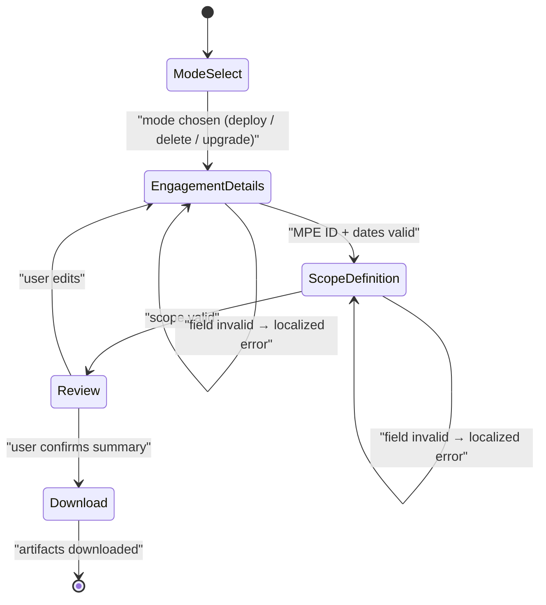

# Business Logic Model — unit-1-configurator

**Date**: 2026-03-25 | **Stories**: US-1, US-2, US-3, US-17, US-18
**Traceability**: FR-1, FR-2, FR-11; NFR-7, NFR-10, NFR-11

This document models the business logic the configurator will implement. It is
technology-agnostic except where the single-file / no-network constraints are
themselves the business rule.

## 1. Wizard Step Flow

The configurator will present a linear, gated wizard. Each step validates before
"Next" is enabled; "Back" never destroys entered data.



| Step | Purpose | Gate to proceed |
|---|---|---|
| Mode Select | Choose lifecycle mode: deploy / delete / upgrade | A mode is selected |
| Engagement Details | MPE ID, agreement start/end dates, customer name, locale | All fields pass validation rules (see `business-rules.md`) |
| Scope Definition | Deployment target (single-account vs org), account scope (ALL vs explicit list), optional VPC list, non-VPC-services switch | Scope rules pass |
| Review | Read-only summary of every entered value (US-1 AC-3) | Explicit user confirmation |
| Download | Generate + download all artifacts | — (terminal) |

Delete and upgrade modes will reuse the same wizard skeleton with a reduced field
set (they need the MPE ID and target identity, not a full scope re-entry).

## 2. Configuration Object Lifecycle

A single in-memory `Configuration` object (see `domain-entities.md`) is the only
state store. It lives in browser memory only — never persisted, never transmitted
(NFR-11, US-18).

```
DRAFT ──(per-field validation on blur)──▶ DRAFT (annotated with field errors)
DRAFT ──(step gate passes)──▶ DRAFT (step N complete)
DRAFT ──(all steps complete + review confirmed)──▶ CONFIRMED
CONFIRMED ──(final revalidation passes)──▶ input to generation pipeline
CONFIRMED ──(final revalidation fails)──▶ back to DRAFT at offending step
```

Rules of the lifecycle:

- Only a `CONFIRMED` and revalidated configuration may enter the generation
  pipeline. Generators will assume their input is valid; the boundary is the
  revalidation, not the generator.
- Editing any field from the Review step returns the object to `DRAFT` and
  invalidates the confirmation.
- Locale is part of the configuration but changing it never invalidates other
  fields — it only re-renders labels/errors through the i18n engine.

## 3. Script / Template Generation Pipeline

On confirmed generation (US-2), a single orchestration function
(`generateAndDownload()` in `app.js`) will run:

```
Configuration (CONFIRMED)
   │  final revalidation (defense-in-depth)
   ▼
For each artifact kind:
   1. select generator      deploy.sh ← script-deploy.js
                            delete.sh ← delete-flow.js
                            upgrade.sh ← upgrade flow
                            CFN template ← template-main.js | template-org.js
   2. interpolate config    every user-supplied value passes the
                            single-quote-containment transform (NFR-7)
   3. stamp version         TEMPLATE_VERSION from constants.js (US-2 AC-3)
   ▼
GeneratedArtifact[] → downloadFile() per artifact (browser Blob download)
```

- Template selection: org mode → `template-org.js` (StackSets), single-account →
  `template-main.js`. The scripts embed or reference the selected template.
- The embedded Lambda handler (unit-2's `lambda-handler.py`) and the service
  registry (unit-4) are compiled into the generators **at build time**, not at
  generation time — the browser never fetches anything.
- Script *content* logic (preflight sequences, waiters, teardown ordering) is
  unit-5's design; unit-1 owns the orchestration, interpolation safety, version
  stamping, and download mechanics.

## 4. i18n Engine Model

- `engine.js` will expose `t(key, params?)` performing key lookup in the active
  locale dictionary, falling back to `en`, and interpolating named params.
- All 7 locale dictionaries ship inside the single HTML artifact.
- Every user-visible string — labels, buttons, help text, and **validation error
  messages** (US-1 AC-2) — must be emitted through `t()`. Hardcoded UI strings
  are a defect.
- Completeness is a build-time contract: a test will diff each locale's key set
  against `en` and fail on any missing key (US-3 AC-2).

## 5. Build-Time Assembly Model

The shipped `configurator.html` is a **generated artifact** (US-17). The build
(`scripts/build.js`) will assemble it deterministically:

```
src/html/configurator.html   skeleton with <!-- BUILD:CSS --> / <!-- BUILD:JS --> placeholders
        │
        ├── inline src/css/styles.css at BUILD:CSS
        ├── concatenate src/js/** in dependency order at BUILD:JS
        │     constants.js → i18n → services (unit-4) → shared/ui → deploy/delete/upgrade flows → app.js
        └── embed src/templates/lambda-handler.py (unit-2), indented for YAML embedding
        ▼
configurator.html  (single file, no external references)
```

- `scripts/verify-build.js` will sanity-check the output: no unresolved
  `BUILD:` placeholders, all entry functions present, no external URL references.
- CI will rebuild from `src/` and fail if the committed artifact differs
  (staleness check, US-17 AC-2). Hand-editing the artifact is thereby
  structurally detectable.
- The YAML distribution (`configurator.yaml`) will be built by a separate script
  from the **same** `src/` modules, so HTML/YAML drift is impossible by
  construction.

## 6. Privacy Model (US-18)

- The artifact contains no `fetch`/`XMLHttpRequest`/analytics/CDN reference; the
  verify script and code review enforce this as a blocking check.
- All processing is synchronous, local, in-memory. Closing the tab discards all
  customer data. This property is auditable by inspecting one file — which is
  itself the reason for the single-file constraint (NFR-10 serves NFR-11).
