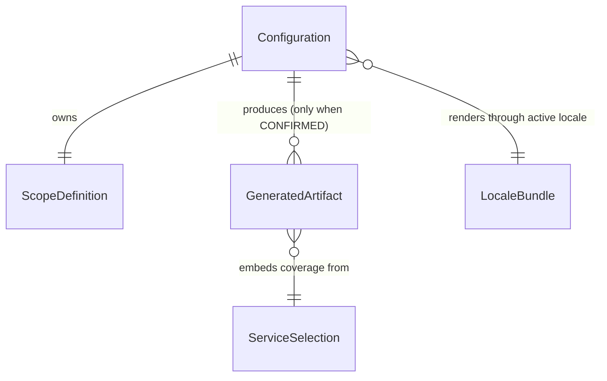

# Domain Entities — unit-1-configurator

**Date**: 2026-03-25 | **Stories**: US-1, US-2, US-3, US-17, US-18

All entities are in-browser, in-memory objects. Nothing is persisted or
transmitted (NFR-11). Field names below are the design vocabulary; concrete JS
naming follows in code generation.

## Configuration

The root aggregate. One instance per wizard session; the sole input to the
generation pipeline.

| Field | Type | Notes |
|---|---|---|
| `mode` | enum `deploy \| delete \| upgrade` | Chosen at Mode Select; determines active field set |
| `mpeId` | string | Validated by BR-C-01; namespaces every downstream resource (FR-9) |
| `agreementStart` | ISO date string | BR-C-02 |
| `agreementEnd` | ISO date string | BR-C-02 (strictly after start) |
| `customerName` | string (optional) | Free text; neutralized at generation by BR-C-10 |
| `locale` | enum of 7 locale codes | `en \| id \| ja \| ko \| th \| vi \| zh` |
| `scope` | ScopeDefinition | See below |
| `deploymentTarget` | enum `single-account \| org-stackset` | Selects template generator |
| `state` | enum `DRAFT \| CONFIRMED` | Lifecycle per business-logic-model §2 |
| `fieldErrors` | map field → localized error key | Populated by validation; empty ⇒ step passes |

## ScopeDefinition

Value object owned by Configuration; serialized into the SSM config parameter
content the templates provision (FR-7, FR-10).

| Field | Type | Notes |
|---|---|---|
| `scopeMode` | enum `ALL \| EXPLICIT` | BR-C-05 mutual exclusivity |
| `scopedAccountIds` | string[] | 12-digit IDs (BR-C-04); required non-empty iff `EXPLICIT` |
| `scopedVpcIds` | string[] | Optional; `vpc-…` format (BR-C-06) |
| `tagNonVpcServices` | boolean | Must be explicitly set when VPC scoping is used (BR-C-06) |

Invariant: `scopeMode = ALL ⇒ scopedAccountIds = []`.

## GeneratedArtifact

The output unit of the generation pipeline; one per downloadable file.

| Field | Type | Notes |
|---|---|---|
| `kind` | enum `deploy-script \| delete-script \| upgrade-script \| cfn-template` | |
| `filename` | string | e.g. `deploy.sh`, fixed per kind |
| `content` | string | Fully interpolated; all user values single-quote contained (BR-C-10) |
| `version` | string | Stamped from `TEMPLATE_VERSION` (BR-C-11) |
| `mimeType` | string | `text/x-shellscript` or `text/yaml` for the Blob download |

Invariant: an instance exists only if produced from a `CONFIRMED`, revalidated
Configuration (BR-C-12); the full set of kinds is always produced together (BR-C-13).

## LocaleBundle

One per supported locale; compiled into the artifact at build time.

| Field | Type | Notes |
|---|---|---|
| `code` | locale code | One of the 7 |
| `strings` | map key → translated string | Key set must equal the `en` reference set (BR-C-21) |
| `isReference` | boolean | True only for `en`; defines the canonical key set and fallback |

## ServiceSelection

Read-only view over unit-4's service registry, embedded at build time. unit-1
does not author service data; it consumes it for review display and for handing
the covered-event set to the template generators.

| Field | Type | Notes |
|---|---|---|
| `services` | ServiceDefinition[] | The full `ALL_SERVICES` registry from unit-4 |
| `eventCount` | number | Derived; shown on the Review step ("~150+ create events covered") |
| `permissionSet` | string[] | Derived union of per-service permissions; feeds least-privilege IAM in the generated template (NFR-5) |

## Relationships

