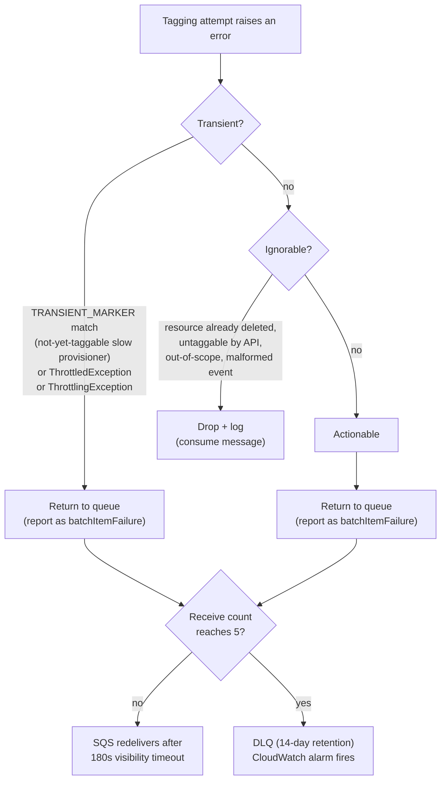

# Business Logic Model — unit-2-lambda-tagger

**Date**: 2026-03-25
**Stage**: Functional Design
**Traceability**: FR-4, FR-7, FR-10, FR-16; NFR-1, NFR-2, NFR-3, NFR-9; US-6, US-13

This document models the event-processing logic the Auto-Tagger Lambda will
implement. It is technology-agnostic where possible; the SQS/SSM touchpoints are
named because they are contractual interfaces owned by unit-3.

## 1. Processing pipeline overview

The handler will process one SQS batch per invocation. Each SQS record wraps an
EventBridge envelope, which wraps a CloudTrail event describing a resource-creation
API call. The pipeline per invocation:

```
SQS batch (1..N records)
  └─ for each record:
       1. Unwrap    — SQS body → EventBridge detail → CloudTrail event (defensive parse)
       2. Identify  — eventSource + eventName → service definition / extractor branch
       3. Gate      — agreement window → account scope → VPC scope (cheap checks first)
       4. Extract   — per-service ARN extraction (may yield multiple ARNs)
       5. Tag       — apply map-migrated=<mpe/server id> to every extracted ARN
       6. Classify  — any failure → actionable | ignorable | transient
  └─ report: batchItemFailures = [message IDs of transient + actionable records]
```

Successfully tagged records and **ignorable** outcomes are consumed (removed from
the queue). **Transient** and **actionable** outcomes are reported as batch item
failures so SQS redelivers them; after 5 receives they land in the DLQ (unit-3's
safety net, FR-5/FR-6). This partial-batch model (`ReportBatchItemFailures`) means
one failing record never forces redelivery of its batch-mates.

## 2. Per-record stages

### Stage 1 — Unwrap (defensive parse, NFR-3)

- Parse the SQS body as JSON; navigate to the CloudTrail `detail`.
- **All** key access uses `ci_get()` — case-insensitive lookup — because CloudTrail
  key casing varies between services and over time (`aRN` vs `arn`). Direct key
  access is a forbidden pattern in this handler.
- Every parse step is wrapped in narrow exception handling. A malformed record is
  classified **ignorable** (logged, dropped) rather than allowed to crash the
  invocation: one bad event must never take down the batch.

### Stage 2 — Identify

- Read `eventSource` (e.g. `rds.amazonaws.com`) and `eventName`
  (e.g. `CreateDBCluster`) and route to the matching extractor branch.
- An event with no matching branch is **ignorable** with a distinct log line —
  under FR-16 parity this should be unreachable (EventBridge only forwards defined
  events), so its occurrence is itself a signal worth logging loudly.

### Stage 3 — Gate (scope evaluation, US-6)

Ordered cheapest-and-most-decisive first; the first failing gate short-circuits to
an **ignorable** outcome (logged with the gate that rejected it):

1. **Agreement window** — event time must fall within [agreement_start, agreement_end].
2. **Account scope** — `recipientAccountId` must be in scope (ALL, or the explicit list).
3. **VPC scope** — see `business-rules.md` R-5/R-6 for the fail-closed rule and the
   `tag_non_vpc_services` switch.

Configuration comes from the cached `MapConfig` (single SSM source, FR-10).

### Stage 4 — Extract

Four extraction patterns, chosen per service (the registry mirrors unit-4's
definitions one-to-one):

| Pattern | Example | Behavior |
|---|---|---|
| Direct | RDS, most services | ARN read from `responseElements` via `ci_get()` |
| Constructed | S3, Lambda | ARN assembled from partition + service + region + account + name |
| Multi-resource | EC2 `RunInstances` | Loop: every instance, plus attached volumes and ENIs |
| Dependent | RDS instance + storage | Primary ARN plus dependent resources that carry cost |

Every event-supplied ARN passes `is_wellformed_arn()` before use; a malformed ARN
is discarded and the branch falls back to construction where possible (R-8).

### Stage 5 — Tag

- Apply `map-migrated=<mpe/server id>` via the Resource Groups Tagging API, or the
  service's native tag API where RGTA does not cover it.
- Tagging is **idempotent** (NFR-1): re-applying the same tag is a safe no-op,
  which is what makes every retry and redelivery in this design correct.

### Stage 6 — Classify

Any exception from stages 4–5 goes through the three-path classifier.

## 3. Three-path error classifier



Key properties:

- **Transient** and **actionable** both return to the queue — the difference is
  intent, logging, and alarm posture: a transient error is *expected* to succeed on
  a later receive within the 15-minute budget (180s × 5); an actionable error is
  expected to exhaust the budget and surface via the DLQ alarm.
- **TRANSIENT_MARKERs** are explicit per-failure-mode substrings for slow
  provisioners (Aurora clusters, ElastiCache Serverless, MSK Serverless: 3–10 min
  to become taggable). A missing marker means premature DLQ for that service class.
- **Both throttle spellings** — `ThrottledException` and `ThrottlingException` —
  classify transient; AWS services disagree on the spelling and a single-substring
  match would silently misclassify one of them.
- Ignorable is the only path that consumes without tagging, and it always logs a
  classifiable line (NFR-12) so trickle-failure analysis remains possible.

## 4. Configuration loading

- `MapConfig` is read from SSM parameter `/auto-map-tagger/{mpe_id}/config` — the
  sole configuration source (FR-10).
- Loaded once per cold start into a module-level cache with a TTL; on refresh
  failure the last-known-good config keeps serving (logged); if no config has ever
  loaded, the batch is failed as transient so SQS redelivers.
- The SSM `get_parameter` call and the JSON/date parsing (`strptime`) are each
  wrapped in narrow exception handling (NFR-3).

## 5. Latency model (US-13, NFR-9)

- Typical path: CloudTrail → EventBridge → SQS → first receive → tag ≈ 60–90 s.
- Slow-provisioner path: transient classification cycles the message through up to
  5 receives × 180 s visibility = 15 min worst case — the retry budget that unit-3's
  queue configuration must match exactly (a coupled constant, changed together or
  not at all).
