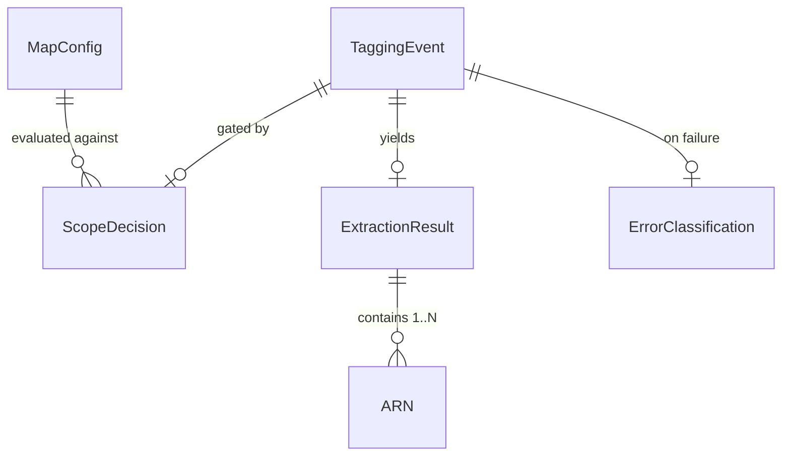

# Domain Entities — unit-2-lambda-tagger

**Date**: 2026-03-25
**Stage**: Functional Design
**Traceability**: FR-4, FR-7, FR-10; NFR-1, NFR-2, NFR-3; US-6, US-13

These are the logical entities the handler will reason about. In the single-file
Python implementation some will be plain dicts or return tuples rather than
classes — the *shape and invariants* below are the contract, not the packaging.

## Entity overview

## TaggingEvent

The unwrapped, normalized view of one SQS record.

| Attribute | Description |
|---|---|
| message_id | SQS message ID — the key reported in `batchItemFailures` |
| event_source | CloudTrail `eventSource`, e.g. `rds.amazonaws.com` |
| event_name | CloudTrail `eventName`, e.g. `CreateDBCluster` |
| event_time | Creation timestamp (parsed defensively; parse failure → ignorable) |
| account_id | `recipientAccountId` |
| region | `awsRegion` |
| detail | The full CloudTrail detail — accessed **only** via `ci_get()` (R-9) |

**Invariant**: constructed only through defensive parsing (R-12); a record that
cannot yield a TaggingEvent is ignorable, never an exception escaping the handler.

## MapConfig

The engagement configuration, deserialized from the single SSM parameter
`/auto-map-tagger/{mpe_id}/config` (FR-10) and cached module-level with a TTL.

| Attribute | Description |
|---|---|
| mpe_id | Engagement identifier — becomes the `map-migrated` tag value (with server-ID formatting) |
| agreement_start / agreement_end | Date window for R-1 |
| scope_mode | `ALL` or `EXPLICIT` |
| scoped_account_ids | Account allowlist when EXPLICIT |
| scoped_vpc_ids | Optional VPC allowlist (R-4/R-5) |
| tag_non_vpc_services | Independent switch for non-VPC-bound resources (R-6) |

**Invariants**: sole config source — no second channel; last-known-good serves
through refresh failures; a handler with no config ever loaded fails the batch as
transient rather than guessing.

## ScopeDecision

The outcome of the gate stage for one TaggingEvent.

| Attribute | Description |
|---|---|
| in_scope | boolean — final verdict |
| rejected_by | Which gate rejected: `date_window` \| `account` \| `vpc` \| `non_vpc_switch` \| none |
| fail_closed | true when R-5 applied (VPC-bound, VPC unknown, scoping active) |

**Invariant**: computed *before* any extraction or tagging; an out-of-scope event
never reaches a tag API. `rejected_by` is always logged (NFR-12).

## ExtractionResult

What the per-service extractor branch produced.

| Attribute | Description |
|---|---|
| arns | 1..N well-formed ARNs (multi-resource events like `RunInstances` yield instances + volumes + ENIs) |
| pattern | `direct` \| `constructed` \| `multi` \| `dependent` — which extraction pattern ran |
| discarded | Event-supplied ARNs that failed `is_wellformed_arn()` and were discarded per R-8 (logged) |

**Invariant**: every ARN in `arns` has passed well-formedness validation; a
malformed ARN can appear only in `discarded`, never in `arns`.

## ErrorClassification

The three-path verdict for a failed tagging attempt (R-10).

| Attribute | Description |
|---|---|
| path | `actionable` \| `ignorable` \| `transient` |
| matched_marker | The TRANSIENT_MARKER or throttle spelling that matched, if transient |
| error_code / error_message | Original error, preserved for the log line |
| disposition | `consume` (ignorable) or `report_failure` (actionable, transient) |

**Invariants**: exactly one path per failure; both `ThrottledException` and
`ThrottlingException` map to transient (R-11); disposition drives the
`batchItemFailures` report — nothing else does.

## Relationships to other units

- **unit-4** owns the service-definition registry; each definition's
  `(source, events[])` pair maps one-to-one to an extractor branch here — the
  FR-16 parity audit enforces both directions.
- **unit-3** owns the physical queue, DLQ, and SSM parameter; this unit consumes
  their contracts (180s × 5 retry budget, config schema above).
