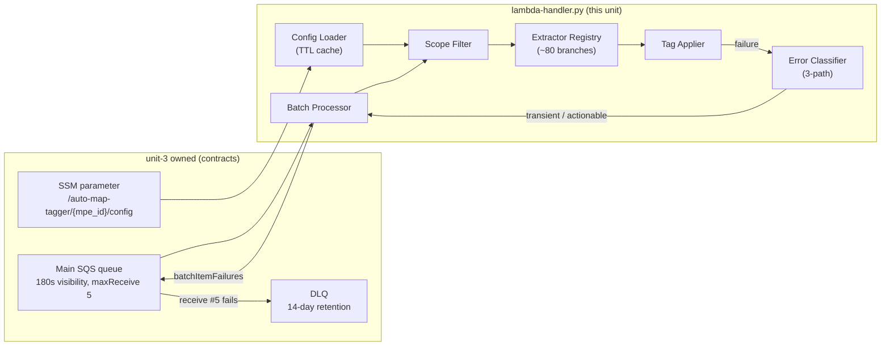

# Logical Components — unit-2-lambda-tagger

**Date**: 2026-03-26
**Stage**: NFR Design
**Traceability**: U2-NFR-1..13; FR-4, FR-7, FR-10, FR-16

Logical components in and around the handler. External components are owned by
unit-3 (physical) but listed because the handler's correctness depends on their
contracted configuration.

## Handler-internal components

### Batch Processor
Entry point. Iterates SQS records, drives the per-record pipeline
(unwrap → gate → extract → tag → classify), accumulates and returns
`batchItemFailures` (message IDs of transient + actionable records only).
Owns the invariant that no exception escapes per-record processing (U2-NFR-7).

### Config Loader
Module-level TTL cache (pattern P-5) over the single SSM parameter (FR-10).
Exposes `get_config()`; encapsulates last-known-good fallback and the
fail-batch-as-transient behavior when unconfigured. The only component that
touches SSM.

### Scope Filter
Evaluates the gate chain — agreement window → account allowlist → VPC scoping
(fail-closed for VPC-bound services, R-5) → `tag_non_vpc_services` switch —
producing a `ScopeDecision` before any extraction or tagging runs (US-6).
Pure function of (TaggingEvent, MapConfig): fully unit-testable.

### Extractor Registry
The per-service ARN extraction branches, keyed by (eventSource, eventName),
mirroring unit-4's service definitions one-to-one (FR-16 parity). Each branch
declares its pattern (direct / constructed / multi-resource / dependent) and
returns an `ExtractionResult` of validated ARNs. Shared helpers used by every
branch:

- `ci_get()` — case-insensitive CloudTrail field access (hard rule R-9)
- `is_wellformed_arn()` — validation gate before trusting event ARNs (R-8)
- ARN constructor — partition/service/region/account/name assembly for the
  constructed pattern and the malformed-ARN fallback

### Tag Applier
Applies `map-migrated=<mpe/server id>` to each extracted ARN — Resource Groups
Tagging API by default, native tag APIs where RGTA cannot reach. Idempotent by
construction (U2-NFR-4): no read-before-write, no dedup state. Lazily creates and
caches boto3 clients (cold-start cost paid once).

### Error Classifier
Single decision function implementing patterns P-2/P-3/P-4: transient checks first
(TRANSIENT_MARKER table + unified two-spelling throttle predicate), then ignorable
signatures (already deleted, untaggable, malformed), default **actionable**.
Returns an `ErrorClassification` whose disposition is the only thing that decides
consume vs report-failure.

### Logger conventions (U2-NFR-11)
One structured line per record outcome: `TAGGED` / `IGNORED <gate-or-reason>` /
`TRANSIENT <marker>` / `ACTIONABLE <error-code>`, plus a cold-start line carrying
the template version. Greppable classification is the observability contract.

## External contracts consumed (unit-3 owned)

| Component | Contracted values this unit depends on |
|---|---|
| Main queue | 180 s visibility × maxReceiveCount 5 = the 900 s budget (coupled constant with U2-NFR-1) |
| DLQ | 14-day retention — the replay window after a fix |
| SSM parameter | Schema of `MapConfig` (see functional design `domain-entities.md`) |
| Execution role | Least-privilege tag actions generated from unit-4 definitions (U2-NFR-9) |
| Lambda resource | 256 MB / 60 s timeout (U2-NFR-2), `ReportBatchItemFailures` enabled on the event source mapping |

Any change to a contracted value is a cross-unit change: it must be reflected here
and in unit-3's infrastructure design together.
