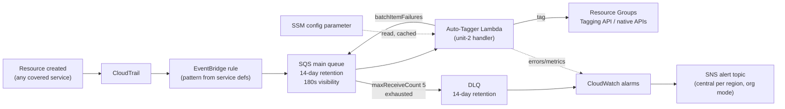

# Business Logic Model — unit-3-infrastructure

**Date**: 2026-03-25
**Stage**: Functional Design
**Traceability**: FR-3, FR-5, FR-6, FR-8, FR-9, FR-10, FR-12; US-4, US-7, US-11, US-12, US-14, US-15

Two models live in this unit: how the templates are *generated* (build time) and
what the deployed resources *do* (runtime).

## 1. Template generation model

Templates are never hand-written YAML. JS template modules assemble them from the
same sources the configurator uses, so the two distribution artifacts (HTML-embedded
and standalone YAML) cannot drift:

```
src/js/services/*  ──┐  (unit-4: source, events[], permissions[])
src/js/constants.js ─┼─► template-main.js ──► per-account pipeline stack YAML
lambda-handler.py ───┘        │
                              └─► template-org.js ──► StackSet wrapper YAML
                                    (StackSet resource, AutoDeployment,
                                     delegated-admin, staging bucket)
```

Generation-time derivations:

- **EventBridge event pattern** — union of every service definition's
  `(source, events[])`: one rule matching all covered creation events (FR-3).
- **IAM policy statements** — union of every definition's `permissions[]`; no
  action appears that doesn't trace to a covered service (NFR-5, US-7). An
  IAM-completeness check gates CI on this derivation.
- **Version stamping** — `TEMPLATE_VERSION` from `constants.js` flows into a CFN
  Output, the SSM version parameter, and the embedded handler's cold-start log.
- **Namespacing** — every resource name is templated as
  `map-auto-tagger-<mpeId>-…` (rule R-1 in `business-rules.md`).
- **Handler embedding** — `lambda-handler.py` is inlined (`ZipFile`) into the
  Lambda resource, indented for YAML.

## 2. Deployment topologies (FR-8)

### Single-account
One stack from the main template in the chosen region: the full pipeline plus a
local alert topic. Suitable for pilots and single-account customers.

### Org-wide (StackSets)
The org template creates a service-managed StackSet with **AutoDeployment
enabled**: the main template deploys automatically to every account in the target
OUs, including accounts created *after* deployment — new accounts must never
silently start life untagged. Delegated-admin deployment is supported so the
management account is not required to run the deploy. A staging S3 bucket holds
the (inline-Lambda, therefore large) template body for StackSet consumption. The
management account additionally hosts the central alert topic per deployed region.

## 3. Runtime event flow through the deployed resources



The queue is the load-bearing element for US-12: EventBridge delivers within
seconds, but Aurora / ElastiCache Serverless / MSK Serverless resources take
3–10 minutes to become taggable — the 180 s visibility × 5 receives budget gives
the handler five spaced attempts over 15 minutes before the DLQ safety net (FR-5,
FR-6). The DLQ's 14-day retention is the manual-replay window (US-14 AC-2).

## 4. Preflight custom resource

A second, small Lambda backs a CloudFormation Custom Resource that runs at stack
create/update, *before* the pipeline goes live:

- **Peer-tagger collision** — detect another tagging solution (or another
  engagement's deployment) already covering this account.
- **Scope intersection** — detect an existing `map-auto-tagger-*` deployment
  whose account scope overlaps this one (US-4 AC-2: the deploy refuses with a
  clear explanation, surfaced as a failed custom resource with reason).

This is the template-side half of FR-15; unit-5's scripts run the pre-CFN half
(IAM capability, stack-state checks).

## 5. Alerting flow (US-11, US-14)

Alarms (TaggerError, DLQFillingUp, TrickleFailure, PeerTaggerDetected — thresholds
in the infrastructure design) publish to the engagement's SNS topic. In org mode,
member-account alarms publish cross-account to the central per-region topic
`auto-map-tagger-alerts-central-<mpe>` in the management account, its policy
scoped by `aws:SourceOrgID`; every notification carries the MPE namespace so the
affected engagement is identifiable from the page (US-11 AC-2).

## 6. Cost model (US-15)

No always-on compute anywhere in the design: EventBridge rules, SQS, on-demand
Lambda, standard SSM parameters, a handful of alarms and one/few topics. Cost
scales with create-event volume only; the < $2/month/account ceiling is
quantified in the NFR requirements.
