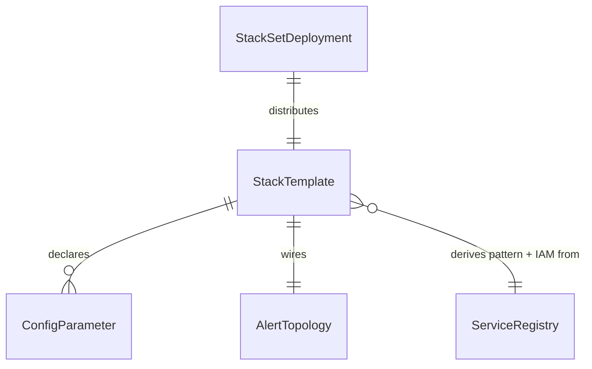

# Domain Entities — unit-3-infrastructure

**Date**: 2026-03-25
**Stage**: Functional Design
**Traceability**: FR-8, FR-9, FR-10, FR-12; US-4, US-11

The entities this unit reasons about at *generation time*. Deployed AWS resources
are the physical realization; these are the logical shapes the template modules
manipulate.

## Entity overview

## StackTemplate

The generated per-account pipeline template (output of `template-main.js`).

| Attribute | Description |
|---|---|
| version | `TEMPLATE_VERSION` from `constants.js` — stamped into a CFN Output, the SSM version parameter, and the handler log |
| namespace | `map-auto-tagger-<mpeId>` — prefix applied to every resource name (R-1) |
| event_pattern | EventBridge pattern derived as the union of unit-4 definitions' `(source, events[])` |
| iam_statements | Union of definitions' `permissions[]` — least-privilege by derivation (R-11) |
| embedded_handler | unit-2's `lambda-handler.py`, inlined as `ZipFile` code |
| queue_config | visibility 180 s, maxReceiveCount 5, retention 14 d — coupled constants (R-6) |
| alarms | TaggerError, DLQFillingUp, TrickleFailure, PeerTaggerDetected |

**Invariants**: generated only — never hand-edited; every derived name passes the
length audit (R-2); the same module output feeds both distribution artifacts.

## StackSetDeployment

The org-mode wrapper (output of `template-org.js`).

| Attribute | Description |
|---|---|
| permission_model | SERVICE_MANAGED — org-integrated StackSets |
| auto_deployment | Always enabled; new accounts in targeted OUs deploy automatically (R-5) |
| delegated_admin | Supported — deploys can run from a delegated administrator account, not only management |
| targets | OU IDs (account-level scope beyond the CFN ceiling uses OU targeting, R-4) |
| staging_bucket | S3 bucket holding the template body (inline handler makes it exceed direct-submission size) |
| regions | Deployment region list; global-service events constrain this (see infrastructure design) |

**Invariant**: distributes exactly the StackTemplate — no org-only divergence in
the pipeline itself.

## AlertTopology

Where alarm notifications go, per deployment mode.

| Attribute | Description |
|---|---|
| mode | `local` (single-account) or `central` (org) |
| central_topic | `auto-map-tagger-alerts-central-<mpe>` in the management account, **one per deployed region** (CloudWatch alarms publish same-region only) |
| publish_scope | Topic policy conditioned on `aws:SourceOrgID` (R-8) |
| kms | Customer-managed key or none — **never** `alias/aws/sns` (hard rule R-7) |
| context | Every notification identifies the MPE namespace and alarm type (US-11 AC-2) |

## ConfigParameter

The single runtime configuration write (FR-10, R-3).

| Attribute | Description |
|---|---|
| name | `/auto-map-tagger/{mpe_id}/config` (plus a sibling `/version` parameter) |
| value | JSON assembled via `!Sub` from CFN parameters: mpe_id, agreement dates, scope_mode, scoped_account_ids, scoped_vpc_ids, tag_non_vpc_services |
| tier | Standard (cost: free — NFR-8) |
| size_ceiling | 4096-byte CFN parameter value → ~270 explicit account IDs (R-4) |
| consumer | unit-2's Config Loader (schema contract = unit-2 `MapConfig`) |

**Invariant**: the stack is the only writer; the Lambda is the only runtime
reader; the JSON schema matches unit-2's `MapConfig` entity field-for-field.

## Relationships to other units

- **ServiceRegistry (unit-4)** is the upstream source for `event_pattern` and
  `iam_statements` — this unit derives, never hand-maintains, either.
- **unit-2** consumes `queue_config` and `ConfigParameter` as contracts; the
  coupled constants are documented on both sides.
- **unit-5** operates on these entities at deploy/upgrade/delete time and owns the
  script-side preflight; the in-template Preflight custom resource is this unit's.
