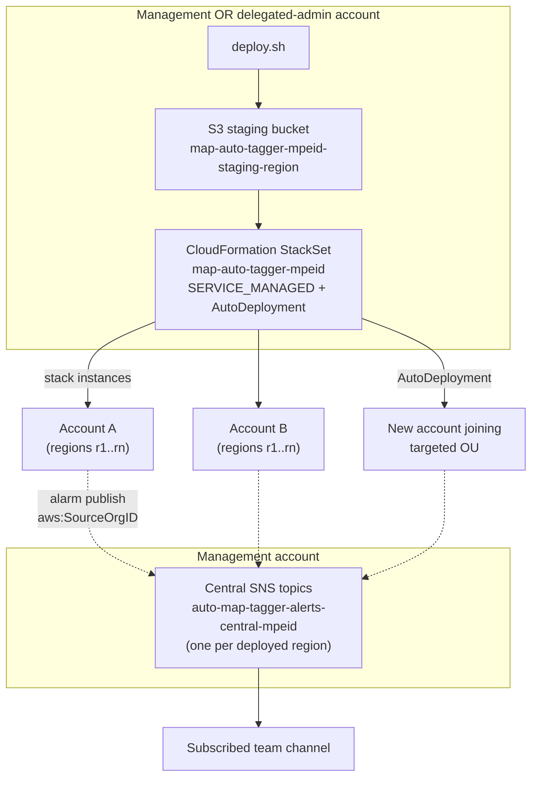

# Deployment Architecture — unit-3-infrastructure

**Date**: 2026-03-26
**Stage**: Infrastructure Design
**Traceability**: FR-8, FR-9; U3-NFR-5, U3-NFR-6, U3-NFR-7, U3-NFR-10

Every resource deploys into **customer-owned accounts** — we host nothing and
nothing calls back to us (NFR-4). Two topologies, both driven by the generated
`deploy.sh` (unit-5) but valid when deployed by console or CLI directly (the
in-template Preflight custom resource guards all paths).

## Topology 1 — Single account

One stack from the main template in each chosen region of one account.

```
deploy.sh → aws cloudformation deploy (template via staging bucket)
          → stack map-auto-tagger-<mpeId>
              ├─ full pipeline (EventBridge → SQS → Lambda → tags)
              ├─ local SNS alert topic
              └─ Preflight custom resource gates create/update
```

Use cases: pilots, single-account customers, pre-production validation of an
engagement's configuration before org rollout. Deleting the stack later and
redeploying org-wide is safe: tagging is idempotent and tags are never removed.

## Topology 2 — Org-wide (StackSets)



### StackSet configuration
- **Permission model**: SERVICE_MANAGED (org-integrated; no self-managed
  execution-role rollout across hundreds of accounts).
- **AutoDeployment: enabled, RetainStacksOnAccountRemoval: false** — an account
  joining a targeted OU is covered automatically; a new account must never
  silently start life untagged (R-5).
- **Targets**: OU IDs. Account-level restriction beyond the explicit-list ceiling
  (~270 accounts, R-4) is done by OU targeting + `scope_mode=ALL`.
- **Operation preferences**: region-parallel with bounded failure tolerance, so
  one misconfigured account does not halt an org rollout silently — failures
  surface in the operation result the deploy script polls.

### Delegated administrator
Deploys may run from a delegated-admin account (CloudFormation delegated
administrator) so day-to-day operation does not require management-account
credentials. The two management-account components (central topics, staging
bucket when the management account hosts it) are created by the deploy flow with
the account it runs in; guidance covers both placements.

### Staging bucket
The inline Lambda handler makes the template exceed the direct-submission body
limit, so the template stages through S3: bucket named with engagement namespace
**and region qualifier** (bucket names are global; two-region deploys must not
collide), lifecycle rule expiring old template objects, public access blocked.

## Region strategy (U3-NFR-7)

- Deploy the pipeline in **every region where the customer creates in-scope
  resources** — events are captured in the region of the API call.
- **Mandatory-region facts**: CloudFront and Route 53 emit only in us-east-1;
  Global Accelerator only in us-west-2. Coverage of those services requires
  those regions in the deployment list; guidance and outputs state this.
- Central alert topics exist **per deployed region** (CloudWatch alarm actions
  are same-region-only).

## Concurrent engagements (US-4)

Multiple MPE engagements coexist as fully disjoint deployments — separate
StackSets, queues, roles, topics, parameters — under their own namespaces. The
Preflight custom resource rejects a new deployment whose account scope intersects
an existing engagement's (US-4 AC-2). Nothing is shared across engagements; the
only intra-engagement shared pieces are the management-account central topics and
staging bucket.

## Lifecycle touchpoints (owned by unit-5, constrained here)

- **Upgrade**: stack/StackSet update with `UsePreviousValue` for existing
  parameters; new parameters take their fail-safe defaults (P-5) — the template
  must remain safe under exactly this update mode.
- **Delete**: removes stacks/StackSet instances only; log groups persist per
  `DeletionPolicy: Retain` (R-10); **no teardown path touches `map-migrated`
  tags** (NFR-6 — enforced in unit-5, honored structurally here by there being
  no tag-removal capability in any deployed component).
