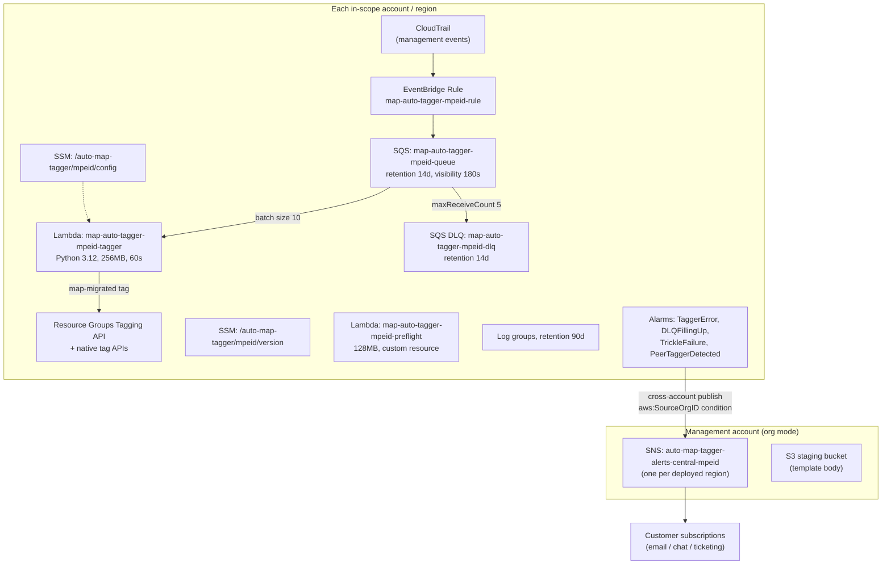

# Infrastructure Design — unit-3-infrastructure

**Date**: 2026-03-26
**Stage**: Infrastructure Design
**Traceability**: FR-3, FR-5, FR-6, FR-9, FR-10, FR-12; U3-NFR-1..11

Concrete resource inventory for the generated templates. All names shown with the
`map-auto-tagger-<mpeId>` namespace (R-1); every derived name passes the
generation-time length audit against a 44-char MPE ID (R-2).

## Architecture

## Resource inventory and configuration values

### Event capture
| Resource | Configuration |
|---|---|
| EventBridge Rule | Pattern = generated union of unit-4 `(source, events[])`; target = main queue; enabled at create |
| Queue policy | Allows `sqs:SendMessage` from `events.amazonaws.com`, conditioned on the rule ARN |

### Messaging (coupled constants, P-4)
| Resource | Configuration |
|---|---|
| Main queue | Standard; **retention 14 days**; **visibility 180 s** (derived: 900 s budget ÷ 5); redrive `maxReceiveCount: 5` → DLQ; no KMS |
| DLQ | Standard; **retention 14 days** (manual-replay window); no KMS |

A unit test asserts `visibility × maxReceiveCount == 900` and `Lambda timeout (60) < visibility (180)`.

### Compute
| Resource | Configuration |
|---|---|
| Auto-Tagger Lambda | `python3.12`; **256 MB / 60 s**; inline `ZipFile` handler (unit-2); env: MPE ID only (config itself always via SSM, R-3) |
| Event source mapping | Batch size **10**; `FunctionResponseTypes: [ReportBatchItemFailures]` — mandatory, unit-2's partial-batch contract |
| Preflight Lambda | `python3.12`; **128 MB / 60 s**; invoked only as a CFN Custom Resource at create/update |

### Configuration store
| Resource | Configuration |
|---|---|
| `/auto-map-tagger/{mpe_id}/config` | Standard tier; JSON via `!Sub` from parameters `MpeId` (≤ 44 chars), `AgreementStartDate`, `AgreementEndDate`, `ScopeMode`, `ScopedAccountIds` (≤ 4096 bytes ≈ ~270 accounts, R-4), `ScopedVpcIds`, `TagNonVpcServices` |
| `/auto-map-tagger/{mpe_id}/version` | Standard tier; `TEMPLATE_VERSION` (also a CFN Output) |

### Monitoring and alerting
| Alarm | Metric | Threshold |
|---|---|---|
| TaggerError | Lambda `Errors` | ≥ 5 in 5 minutes (spike) |
| DLQFillingUp | DLQ `ApproximateNumberOfMessagesVisible` | **≥ 1** — one parked message is credit loss in progress |
| TrickleFailure | Failure signal (metric filter on classified log lines) | ≥ 1 error in each of 3 consecutive 1-hour periods |
| PeerTaggerDetected | Collision metric (Preflight/runtime detection) | ≥ 1 |

| Resource | Configuration |
|---|---|
| SNS topic (single-account) | Local, namespaced; customer-managed KMS or none — **never `alias/aws/sns`** (R-7) |
| SNS topics (org) | `auto-map-tagger-alerts-central-<mpe>` per deployed region, management account; policy: `sns:Publish` from CloudWatch alarms org-wide, condition `aws:SourceOrgID` (R-8) |
| Log groups | Both Lambdas; **retention 90 days**; explicit `DeletionPolicy: Retain` (R-10) |

## IAM model (U3-NFR-9)

| Role | Grants |
|---|---|
| Tagger execution role | Generated union of unit-4 `permissions[]` (per-service tag actions, e.g. `tag:TagResources`, `s3:PutBucketTagging`, `ec2:CreateTags`, …) — every action traces to a covered service, no wildcards; + `ssm:GetParameter` on the engagement's two parameters; + SQS consume on the main queue; + CloudWatch Logs write on its own group |
| Preflight execution role | Read-only: describe/list on stacks, rules, SSM parameters needed for collision + scope-intersection checks; Logs write |
| StackSet roles (org) | AWS-managed service-linked roles (SERVICE_MANAGED model) — none of ours |

The IAM-completeness CI gate diffs the generated policy against the service
definitions in both directions. The customer owns every role (Shared
Responsibility Model) — stated in outputs/docs, never assumed.

## Global-service region notes (U3-NFR-7)

| Service | CloudTrail emission region | Consequence |
|---|---|---|
| CloudFront | **us-east-1 only** | Pipeline must be deployed in us-east-1 to tag these resources |
| Route 53 | **us-east-1 only** | Same |
| Global Accelerator | **us-west-2 only** | Pipeline must be deployed in us-west-2 |

The templates cannot change this — it is where AWS emits the events. Deployment
guidance and template outputs state it explicitly so any gap is a known decision.

## Cost reconciliation (U3-NFR-4)

At typical volumes (≤ a few thousand create events/month/account): EventBridge
rule invocations, SQS requests, and Lambda GB-seconds each land in the
cents-per-month range; standard SSM parameters are free; 4 alarms ≈ $0.40; 90-day
log retention on low log volume is cents. Estimated total **well under
$2/month/account**, with no always-on compute anywhere (US-15 AC-2). Verified
against real billing during Build and Test.
