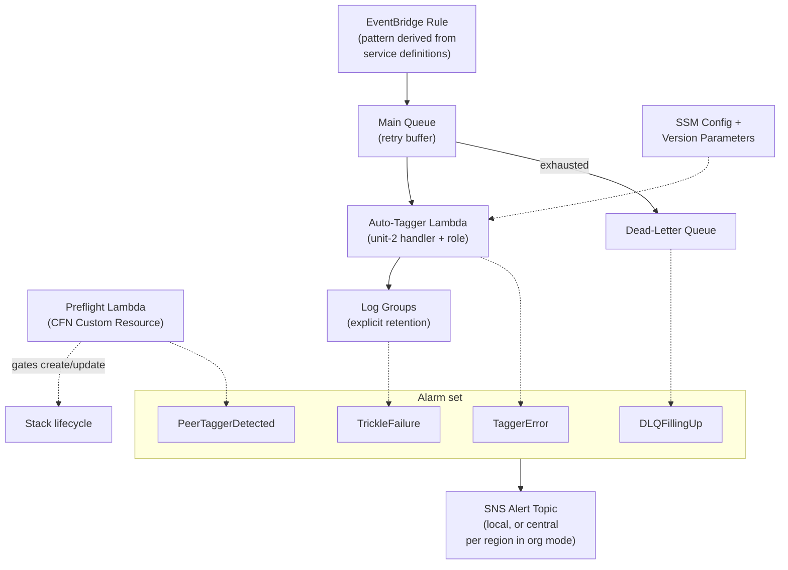

# Logical Components — unit-3-infrastructure

**Date**: 2026-03-26
**Stage**: NFR Design
**Traceability**: U3-NFR-1..11; FR-3, FR-5, FR-6, FR-9, FR-10, FR-12

Logical components of the deployed per-account pipeline (plus the org-mode
additions). Physical resource properties and thresholds are finalized in the
Infrastructure Design stage; this document fixes each component's role and the
NFRs it carries.

## EventBridge Rule
Matches every covered creation event — the pattern is the generated union of
unit-4 definitions' `(source, events[])`, never hand-maintained. One rule per
engagement, namespaced (R-1). Carries U3-NFR-3 (capture-to-buffer, no volatile
window) by targeting the queue directly.

## Main Queue (retry buffer)
SQS standard, engagement-namespaced. Carries U3-NFR-1 (14-day retention) and
U3-NFR-2 (180 s visibility × maxReceiveCount 5 — the derived coupled constant,
pattern P-4). No KMS (cost, U3-NFR-4; contains only CloudTrail event copies).
Redrive policy targets the DLQ.

## Dead-Letter Queue
The parked-and-alerted terminal state (pattern P-1). 14-day retention = the
manual-replay window; replay re-enters the main queue and is safe by unit-2
idempotency. Watched by DLQFillingUp.

## Auto-Tagger Lambda (resource + role)
Hosts unit-2's handler (inline `ZipFile`, 256 MB / 60 s per unit-2's U2-NFR-2;
timeout < visibility per P-4). Event source mapping with
`ReportBatchItemFailures` enabled — without this flag unit-2's partial-batch
design silently degrades to whole-batch redelivery. Execution role: generated
least-privilege union of unit-4 `permissions[]` + SSM read on the engagement's
parameters + SQS consume + logs (U3-NFR-9).

## Preflight Lambda (CFN Custom Resource)
Pattern P-3: gates stack create/update on peer-tagger collision and
cross-engagement scope intersection; fails the stack with an explanatory reason.
Read-only IAM (describe/list only). Runs in-template so console and
AutoDeployment paths are covered, not just scripted deploys.

## SSM Parameters
- `/auto-map-tagger/{mpe_id}/config` — the single runtime config source, JSON
  assembled via `!Sub` from CFN parameters (R-3); schema is unit-2's `MapConfig`
  contract. Standard tier (free, U3-NFR-4).
- `/auto-map-tagger/{mpe_id}/version` — version visibility (U3-NFR-11), alongside
  the CFN Output and the handler's cold-start log line.

## Alarm set (FR-12, R-9)
| Alarm | Watches | Failure mode covered |
|---|---|---|
| TaggerError | Lambda error metric | Handler crashes / actionable spikes |
| DLQFillingUp | DLQ depth | Retry-budget exhaustion — credit loss in progress |
| TrickleFailure | Sustained low-rate failure signal | Slow leakage that never spikes past a burst threshold (US-11 AC-3) |
| PeerTaggerDetected | Collision signal | Conflicting tagger appearing post-deploy (backstop to Preflight) |

Every alarm name/message embeds the MPE namespace. Thresholds are fixed in the
Infrastructure Design stage.

## SNS Alert Topic(s)
Pattern P-2. Single-account mode: one local namespaced topic. Org mode: central
per-region topic `auto-map-tagger-alerts-central-<mpe>` in the management
account, publish scoped by `aws:SourceOrgID`. **Never** `alias/aws/sns` on any
alarm topic (hard rule R-7 / U3-NFR-8).

## Log Groups
Explicitly declared for both Lambdas with explicit retention (cost, U3-NFR-4) and
DeletionPolicy (operational history survives teardown, R-10).

## Org-mode additions
- **StackSet** (SERVICE_MANAGED, AutoDeployment on, delegated-admin capable) —
  U3-NFR-5.
- **Staging bucket** — namespaced, region-qualified; holds the template body
  (inline handler exceeds direct-submission size).
- **Central alert topics** — one per deployed region, management account.

Deployment topology detail and the full resource inventory with concrete values
follow in `infrastructure-design/`.
