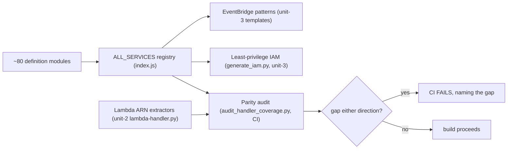

# Business Logic Model — unit-4-service-definitions

**Date**: 2026-03-25 | **Story**: US-16
**Traceability**: FR-3, FR-16; NFR-5

unit-4 is a data-and-contract unit: it holds no runtime behavior of its own.
Its logic is (1) the shape every definition must satisfy, (2) the aggregate
registry, and (3) the fan-out of that registry into three downstream consumers
with a CI audit keeping them consistent.

## 1. Definition Module Contract

One file per covered AWS service in `src/js/services/`, exporting a single
constant of the canonical shape:

```js
// src/js/services/rds.js
const SERVICE_RDS = {
    source: 'aws.rds',                                  // CloudTrail event source
    events: ['CreateDBInstance', 'CreateDBCluster'],    // create-type API event names
    permissions: ['rds:AddTagsToResource'],             // tagging actions the handler needs
};
```

Contract obligations per module:

- `source` is the exact CloudTrail `eventSource` prefix (`aws.<svc>` in
  EventBridge pattern form) — this string drives event matching; a typo here is
  silent 100% tag loss for the service.
- `events` lists resource-**creation** API names only (see BR-S-02 in
  `business-rules.md`). Each event name is a promise: "the Lambda has an ARN
  extractor for this event."
- `permissions` lists exactly the tagging actions unit-2's handler will call for
  this service — no more (least privilege, NFR-5), no fewer (a missing action is
  a runtime `AccessDenied` → tag loss).

## 2. The ALL_SERVICES Registry

`src/js/services/index.js` will aggregate every definition into one explicit
array:

```js
const ALL_SERVICES = [
    SERVICE_EC2, SERVICE_S3, SERVICE_RDS, /* ... ~80 entries ... */
];
```

Registry invariants (all test/CI-enforced):

- Every module file in `src/js/services/` appears in `ALL_SERVICES` exactly once
  (defined-but-unregistered = CI failure; the file exists for a reason).
- No two entries share a `source`; within an entry, no duplicate event names.
- The registry is the **only** coverage source of truth — no consumer maintains
  its own service list.

## 3. Fan-Out to Consumers



### 3a. EventBridge patterns (FR-3)
The template generators (unit-3, assembled by unit-1's build) derive event
patterns directly from the registry: for each definition, a rule matching
`source = aws.<svc>` and `detail.eventName ∈ events`. Adding a service to the
registry is therefore sufficient to start capturing its events — no template
edit.

### 3b. Least-privilege IAM (NFR-5)
IAM generation (`generate_iam.py`) computes the union of all `permissions`
arrays plus the fixed pipeline baseline (Tagging API, SQS, SSM read, logs).
Every granted action traces back to a definition; an IAM-completeness CI check
fails if the generated policy and the registry diverge in either direction
(US-7's acceptance criteria, owned by unit-3, are satisfied *through* this
registry).

### 3c. Handler-parity audit (FR-16)
`audit_handler_coverage.py` will parse two artifacts:

1. the registry — the set of `(source, event)` pairs promised;
2. `src/templates/lambda-handler.py` — the set of `(source, event)` pairs the
   extractor dispatch actually handles.

It computes the symmetric difference and **fails CI naming each gap**
(US-16 AC-1/AC-2). Both directions are defects: definition-without-handler is a
matched event nobody can extract (silent tag loss); handler-without-definition
is unreachable code with no event rule and no IAM grant.

## 4. Golden-Event Fixture Corpus

Every covered service lands with at least one **real captured** CloudTrail event
fixture (not hand-written) under the test fixtures tree, replayed by unit-2's
handler tests (US-16 AC-3). Rationale: AWS changes event shapes without notice;
a corpus of real events is the only static defense against shape drift. The
fixture requirement is checked alongside parity — a new definition without a
fixture is flagged.

## 5. Change Workflow (what US-16 makes safe)

Adding a service = exactly four artifacts, gate-checked together:

1. `src/js/services/<svc>.js` (definition),
2. registration in `index.js`,
3. matching extractor in unit-2's handler,
4. a real captured event fixture.

Miss any one → a named CI failure. Coverage can only grow in lockstep.

On each MAP Included Services List revision: diff the whole list against the
registry in both directions and update the pinned edition date in
`docs/MAP_included.md`.
