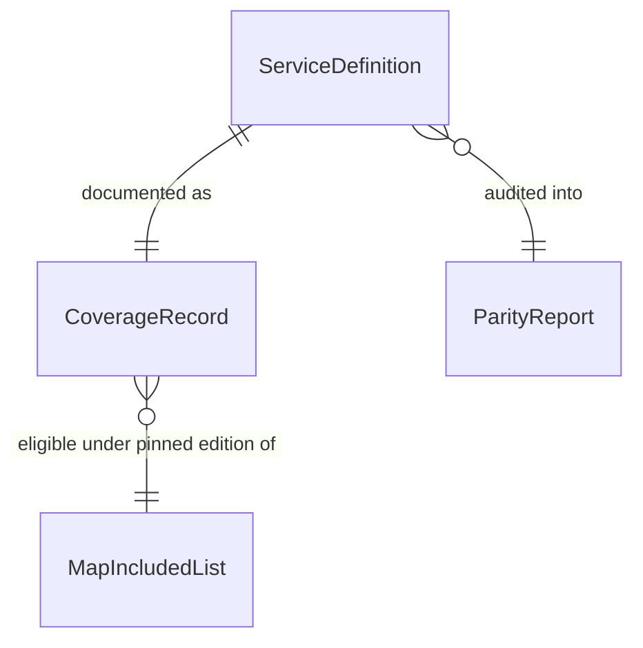

# Domain Entities — unit-4-service-definitions

**Date**: 2026-03-25 | **Story**: US-16
**Traceability**: FR-3, FR-16; NFR-5

## ServiceDefinition

The atomic unit of coverage. One per covered AWS service, one file per instance
in `src/js/services/`.

| Field | Type | Notes |
|---|---|---|
| `source` | string | CloudTrail/EventBridge event source, `aws.<svc>` (e.g., `aws.rds`). Unique across the registry (BR-S-03). Drives event-pattern matching — a typo is silent 100% tag loss for the service. |
| `events` | string[] | Create-type API event names (BR-S-02), non-empty, no duplicates. Each entry is a promise that a matching ARN extractor exists in unit-2 (BR-S-30). |
| `permissions` | string[] | Least-privilege tagging actions this service's extractor needs (BR-S-10). Feeds generated IAM (BR-S-11). May be empty only when the generic `tag:TagResources` baseline suffices. |

Invariants: exactly these three fields; `source` matches `^aws\.[a-z0-9-]+$`;
registered exactly once in `ALL_SERVICES` (BR-S-04); the service appears on the
pinned MAP Included Services List edition (BR-S-20).

## CoverageRecord

The documentation-facing projection of coverage — what `docs/COVERAGE.md`
rows are made of. Derived from a ServiceDefinition plus verification state;
exists because a definition merging is *not* the same as coverage being real.

| Field | Type | Notes |
|---|---|---|
| `service` | string | Human-readable service name |
| `source` | string | Back-reference to the ServiceDefinition |
| `events` | string[] | Covered create events, as shipped |
| `verificationStatus` | enum `VERIFIED \| UNVERIFIED \| KNOWN_GAP` | `VERIFIED` only after a real resource has been observed receiving the tag (BR-S-40); handler-exists + tests-green is not the bar |
| `mapListEdition` | date | The pinned MAP list edition under which this service is eligible (BR-S-21) |
| `fixtureRef` | string | Path to the real captured CloudTrail event fixture (BR-S-32) |

## ParityReport

The output of `audit_handler_coverage.py` — the machine verdict on FR-16.
Produced on every CI run; a non-empty gap set in either direction fails the
build.

| Field | Type | Notes |
|---|---|---|
| `definedPairs` | set of (source, event) | Extracted from `ALL_SERVICES` |
| `handledPairs` | set of (source, event) | Extracted from unit-2's `lambda-handler.py` dispatch |
| `missingHandlers` | set of (source, event) | `definedPairs − handledPairs` — silent-tag-loss gaps (BR-S-30) |
| `orphanHandlers` | set of (source, event) | `handledPairs − definedPairs` — dead extractors (BR-S-31) |
| `verdict` | enum `PASS \| FAIL` | `PASS` iff both gap sets are empty |
| `gapDetails` | list of named gaps | Each failure names the service and event so the contributor knows exactly what to add (US-16 AC-1/AC-2) |

## Relationships

`MapIncludedList` (the pinned external list in `docs/MAP_included.md`) is a
referenced external artifact, not an entity this unit owns — but every
ServiceDefinition's existence is justified against it.
