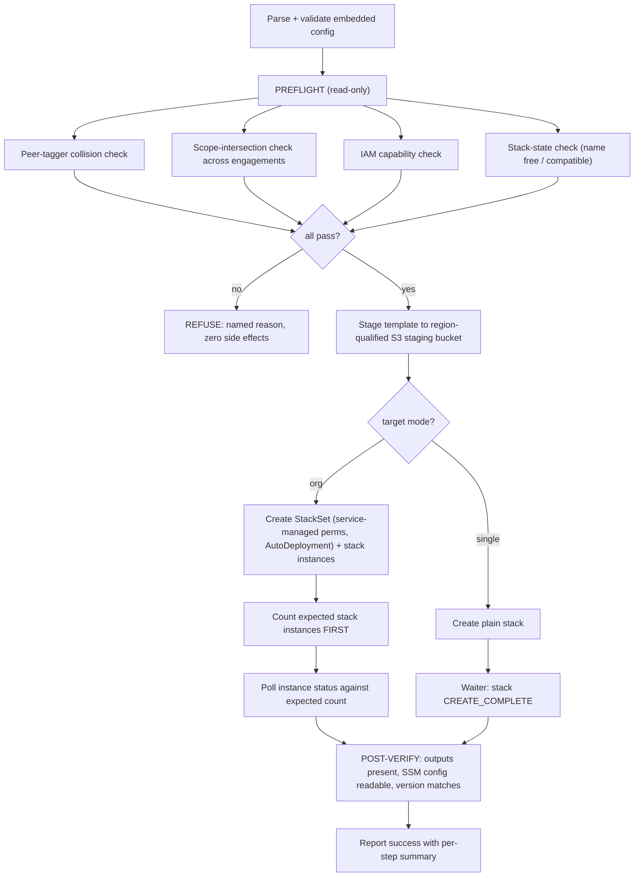
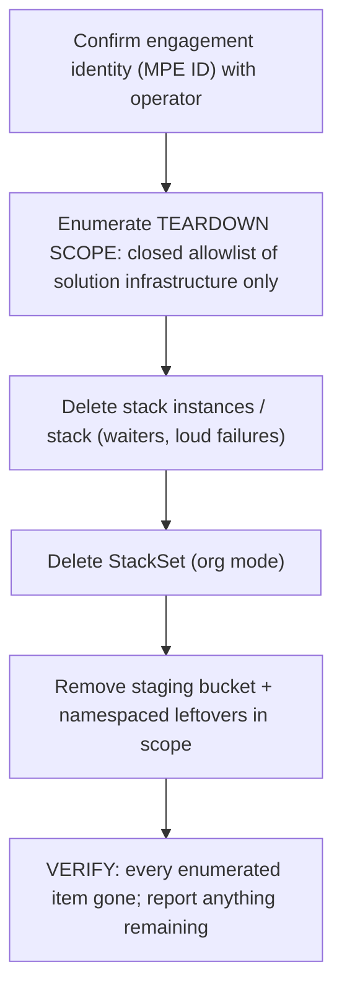
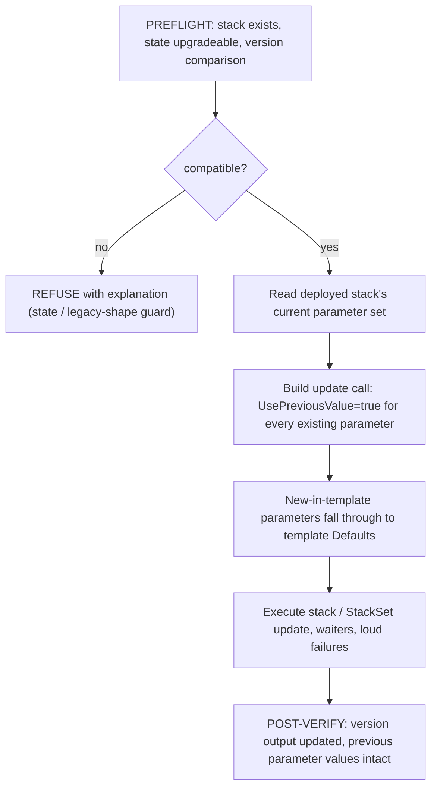

# Business Logic Model — unit-5-lifecycle-ops

**Date**: 2026-03-25 | **Stories**: US-5, US-8, US-9, US-10
**Traceability**: FR-2, FR-8, FR-13, FR-14, FR-15; NFR-6, NFR-7

This unit designs the behavior of the three generated lifecycle scripts. The
scripts run in the customer's shell with the customer's credentials; every flow
therefore follows one meta-pattern: **preflight (read-only) → mutate (loud
failures) → verify (against expected counts)**.

## 1. Deploy Flow (`deploy.sh` — US-5)

Flow rules:

- **Preflight is read-only** — describe/list/get calls only. A refusal leaves
  the account byte-identical (US-10 AC-2).
- **Every state-mutating CLI call fails loudly.** No mutating call may be
  wrapped in `>/dev/null 2>&1 || true` — a swallowed failure is a silent partial
  deploy (US-5 AC-3). Only truly cosmetic calls may ignore errors, with an
  inline comment saying why.
- **Count-then-poll**: for StackSet deployment, the script first counts the
  expected instances (in-scope accounts × regions), then polls completion
  *against that count*. A poll that exits on "no instances in progress" cannot
  distinguish "nothing was created" from "everything finished" (BR-L-05).
- **Org and single-account modes produce identical runtime behavior** — same
  pipeline, same namespacing, same config (US-5 AC-2).

## 2. Delete Flow (`delete.sh` — US-9)

Flow rules:

- **Structurally no tag path.** The delete flow contains no untag / RemoveTags /
  DeleteTags call of any kind — customer resources are simply outside the
  teardown enumeration. This is the design's answer to NFR-6: the guarantee is
  the absence of the code path, verified by a regression test that scans
  generated output for tag-removal APIs (US-9 AC-2).
- **Teardown scope is an allowlist**, not a query: EventBridge rules, SQS
  queues + DLQ, Lambda, IAM roles/policies, SSM parameters, alarms, SNS topic,
  staging bucket — all under the `map-auto-tagger-<mpeId>` namespace of *this*
  engagement only. Other engagements' resources are untouched (FR-9).
- **Operational data is preserved deliberately** — log groups keep their
  retention/deletion policy; teardown must not silently destroy data the
  customer may need.
- **Count-then-verify** applies here too: enumerate what will be deleted first,
  then verify each enumerated item is gone; report leftovers explicitly rather
  than exiting on an empty in-progress list.

## 3. Upgrade Flow (`upgrade.sh` — US-8)

Flow rules:

- **The deployed stack is the source of truth for configured values.** The
  upgrade never re-sends values from the newly generated script for parameters
  the stack already has — `UsePreviousValue=true` for each (FR-13, US-8 AC-1).
- **New parameters must have safe defaults** — this is the release-classification
  corollary: a new parameter without a safe default makes the release
  "full redeploy required," and `upgrade.sh` cannot be used for it.
- **Preflight refuses incompatible stacks** — wrong state (e.g., mid-rollback)
  or a legacy parameter shape the update path can't handle safely produce a
  refusal with an explanation, never a best-effort attempt (US-8 AC-2).

## 4. Preflight Suite (shared — US-10)

Four checks, all read-only, all before any mutation, in both deploy and upgrade:

| Check | Question it answers | Refusal message names |
|---|---|---|
| Peer-tagger collision | Is another auto-tagger (this solution, different MPE, or a third-party tagger) already active here? | The conflicting engagement/stack |
| Scope intersection | Does this engagement's account/VPC scope overlap another engagement's scope? | Both engagements and the overlapping accounts |
| IAM capability | Can the caller create the roles/stacks this operation needs? | The missing capability/action |
| Stack state | Is the target name free (deploy) / the stack updateable (upgrade)? | The stack and its current state |

Aggregation rule: run **all** checks and report **all** failures together (an
operator should not fix one refusal only to hit the next), then exit non-zero
having mutated nothing.

## 5. Generation-Time Safety (with unit-1)

Script *content* is produced by generator modules (`script-deploy.js`,
`delete-flow.js`, upgrade flow) that unit-1 assembles and invokes. Every
user-supplied value interpolated into script text passes single-quote
containment (NFR-7); the shell-injection lint gates all generated script
content in CI. Division of ownership: unit-1 owns interpolation mechanics and
download; unit-5 owns what the scripts *do*.
