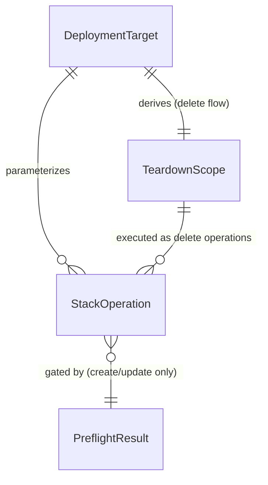

# Domain Entities — unit-5-lifecycle-ops

**Date**: 2026-03-25 | **Stories**: US-5, US-8, US-9, US-10
**Traceability**: FR-8, FR-13, FR-14, FR-15; NFR-6

These entities describe the concepts the generated scripts operate on. They are
design vocabulary — realized as script variables and generator inputs, not
runtime objects.

## DeploymentTarget

Where and how an operation applies. Fixed at generation time from the
configurator's scope step; a generated script carries exactly one target.

| Field | Type | Notes |
|---|---|---|
| `mode` | enum `single-account \| org-stackset` | Selects plain-stack vs StackSet path (BR-L-10) |
| `mpeId` | string | Namespaces every resource: `map-auto-tagger-<mpeId>` (FR-9) |
| `accountScope` | `ALL` or 12-digit account ID list | For org mode, defines stack-instance targets and the expected-count input to polls (BR-L-05) |
| `regions` | string[] | Deployment regions; part of expected-count arithmetic |
| `delegatedAdmin` | boolean | Org mode: whether operating from a delegated CloudFormation admin account (US-5 AC-1) |
| `stagingBucket` | string (derived) | Region-qualified, engagement-namespaced template staging bucket (BR-L-11) |

## PreflightResult

The aggregated outcome of the read-only preflight suite; produced before any
mutation in deploy and upgrade (BR-L-04, BR-L-42).

| Field | Type | Notes |
|---|---|---|
| `checks` | list of CheckOutcome | One per check: peer-tagger collision, scope intersection, IAM capability, stack state |
| `verdict` | enum `PROCEED \| REFUSE` | `REFUSE` if any check failed |
| `refusals` | list | Every failed check with its named subject — conflicting engagement/stack, overlapping account IDs, missing IAM action, offending stack state (BR-L-41) |

CheckOutcome: `{check, status: PASS|FAIL, subject, explanation}`.

Invariants: computed exclusively from read-only calls (BR-L-40); a `REFUSE`
verdict guarantees zero side effects — the script exits non-zero having mutated
nothing (US-10 AC-2); all failures are reported together, not serially.

## StackOperation

One mutating CloudFormation operation and its verification contract.

| Field | Type | Notes |
|---|---|---|
| `kind` | enum `create \| update \| delete` | Deploy / upgrade / delete flows respectively |
| `scope` | enum `stack \| stackset` | Per DeploymentTarget.mode |
| `parameterStrategy` | enum `explicit \| use-previous-with-defaults` | Deploy sends explicit values; upgrade sends `UsePreviousValue=true` for existing parameters, template defaults for new ones (BR-L-30/31) |
| `expectedCount` | number | Counted BEFORE the operation (accounts × regions for StackSets; 1 for a stack); the poll's denominator (BR-L-05). Zero expected work is an explicit error, not success |
| `waiter` | descriptor | The completion condition polled against `expectedCount` |
| `failureReporting` | contract | Loud failure: non-zero exit naming the failed step and what was already created (BR-L-02, BR-L-12) |

## TeardownScope

The closed allowlist of what `delete.sh` may remove (BR-L-20). Enumerated
before deletion; verified after (BR-L-22).

| Field | Type | Notes |
|---|---|---|
| `mpeId` | string | Only THIS engagement's namespace is in scope |
| `items` | enumerated list | EventBridge rules, SQS main queue + DLQ, Lambda, IAM roles/policies, SSM parameters, CloudWatch alarms, SNS topic, staging bucket — all `map-auto-tagger-<mpeId>`-namespaced |
| `preserved` | list | Log groups per retention policy (BR-L-21); ALL customer resources and their tags |
| `verification` | contract | Each enumerated item re-checked gone; leftovers reported explicitly |

**Structural invariant (NFR-6 / BR-L-01)**: `TeardownScope.items` can only name
solution infrastructure. Customer resources — and therefore `map-migrated`
tags — are not representable in a teardown scope; there is no field, no code
path, and no API call through which delete can reach them. This is the entity-
level expression of "delete never touches tags."

## Relationships

