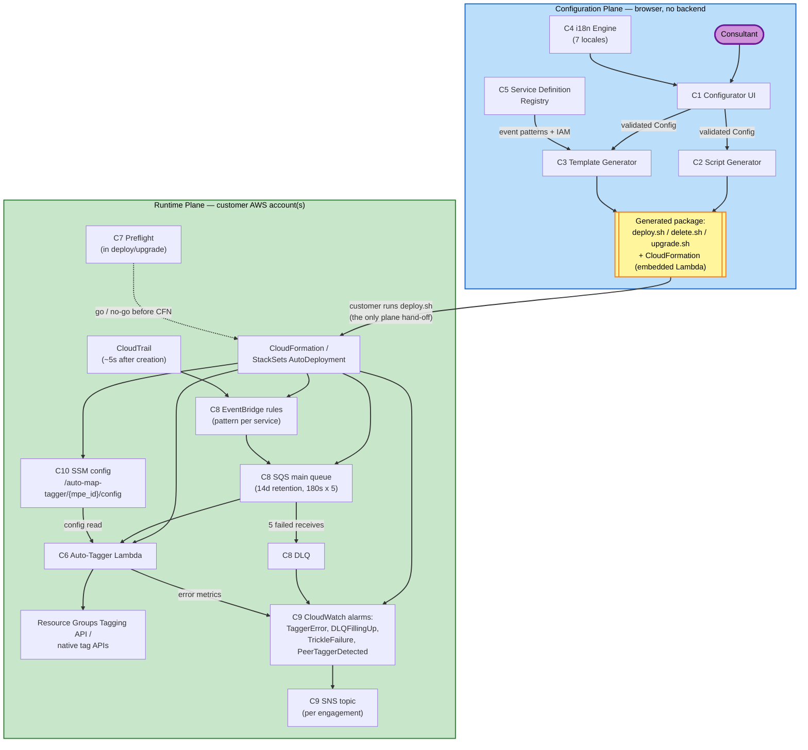

# Component Dependencies — MAP 2.0 Auto-Tagger

## Dependency Matrix

Row depends on column (B = build-time, R = runtime, G = generation-time — i.e., embedded into a generated artifact).

| Component | C1 UI | C2 Script Gen | C3 Template Gen | C4 i18n | C5 Registry | C6 Lambda | C7 Preflight | C8 Pipeline | C9 Alerting | C10 Config Store |
|---|---|---|---|---|---|---|---|---|---|---|
| **C1 Configurator UI** | — | R | R | R | — | — | — | — | — | — |
| **C2 Script Generator** | — | — | — | — | — | — | G (embeds) | — | — | — |
| **C3 Template Generator** | — | — | — | — | R (patterns, IAM) | G (embeds source) | — | G (declares) | G (declares) | G (declares) |
| **C4 i18n Engine** | — | — | — | — | — | — | — | — | — | — |
| **C5 Service Definition Registry** | — | — | — | — | — | B (parity audit) | — | — | — | — |
| **C6 Auto-Tagger Lambda** | — | — | — | — | — | — | — | R (consumes SQS) | — | R (reads config) |
| **C7 Preflight** | — | — | — | — | — | — | — | — | — | R (reads peer configs) |
| **C8 Event Pipeline** | — | — | — | — | — | R (invokes) | — | — | — | — |
| **C9 Alerting** | — | — | — | — | — | R (metrics) | — | R (DLQ depth) | — | — |
| **C10 Config Store** | — | — | — | — | — | — | — | — | — | — |

Key observations:
- **C5 (Registry) is the coverage contract**: C3 derives event patterns and IAM from it; the build-time parity audit holds C6's handlers to it in both directions.
- **The planes share no runtime dependency**: every arrow from the configuration plane into the runtime plane is generation-time embedding (G), never a call.
- **C4 (i18n) and C10 (Config Store) are leaf dependencies** — nothing they depend on, many depend on them.

## Data-Flow Diagram (both planes)

## Communication Patterns

| Path | Pattern | Rationale |
|---|---|---|
| Configuration plane → runtime plane | **Generated artifacts only** (scripts + template with embedded handler). No API, no polling, no callback. | Privacy by construction (NFR-11) and no-outbound-calls hard rule (NFR-4); the planes cannot drift into runtime coupling. |
| CloudTrail → EventBridge → SQS → Lambda | **Event-driven async with durable buffering** | Decouples event arrival from taggability (slow provisioners); absorbs throttles/outages; retry semantics live in one place (queue policy). |
| Lambda → tag APIs | **Idempotent synchronous calls with partial batch response** | Re-applying a tag is a safe no-op, so at-least-once delivery is correct; per-record failure reporting keeps one bad event from recycling a whole batch. |
| Failure → DLQ → alarm → SNS | **Escalation chain, no automatic reprocessing** | Exhausted messages need human judgment (replay after fix); automatic re-drive could loop on a systemic fault. |
| Lambda/Preflight → SSM | **Read-through cached config reads** | Single config source (FR-10); config changes apply without redeploy; defensive parsing prevents a bad write from crashing the tagger. |
| Registry → template/IAM/audit | **Build-time derivation from one declarative contract** | Event patterns, IAM grants, and handler parity can never disagree with each other because all three derive from C5. |
