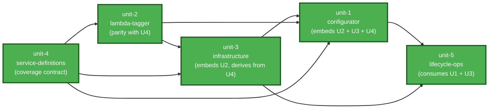

# Unit of Work Dependencies — MAP 2.0 Auto-Tagger

## Dependency Matrix

Row depends on column. **P** = parity/contract coupling (CI-enforced), **E** = embeds at build/generation time, **C** = consumes outputs, **D** = derives content from.

| Unit | unit-1 configurator | unit-2 lambda-tagger | unit-3 infrastructure | unit-4 service-definitions | unit-5 lifecycle-ops |
|---|---|---|---|---|---|
| **unit-1-configurator** | — | E (embeds handler into built HTML/template) | E (embeds template generators into built HTML) | E (embeds registry for pattern/IAM generation) | E (embeds script-generation flows) |
| **unit-2-lambda-tagger** | — | — | — | P (every definition needs a handler; audit is bidirectional) | — |
| **unit-3-infrastructure** | — | E (template embeds handler source) | — | D (event patterns + IAM derived from definitions) | — |
| **unit-4-service-definitions** | — | P (audit fails on handler without definition) | — | — | — |
| **unit-5-lifecycle-ops** | C (operates on the generated deploy/delete/upgrade artifacts) | — | C (orchestrates unit-3 stacks; preflight reads unit-3 SSM/stack state) | — | — |

## Key Couplings

1. **unit-4 ↔ unit-2 parity (the load-bearing contract)**: every service definition must have a matching ARN-extraction handler and every handler a definition. The `audit_handler_coverage` CI gate enforces this in both directions; a change to either unit is incomplete until the audit passes.
2. **unit-1 embeds unit-2 + unit-3 + unit-4**: the build inlines the Lambda handler, template generators, and the service registry into the single-file configurator. unit-1's artifact is therefore stale whenever any embedded unit changes — the build-staleness CI gate protects this.
3. **unit-3 derives from unit-4**: EventBridge patterns and least-privilege IAM are generated from the registry, never hand-listed — IAM completeness is CI-checked against the definitions.
4. **unit-5 consumes unit-1 outputs and unit-3 state**: the lifecycle scripts are generated by the configurator and act on the deployed infrastructure; preflight reads peer engagements' SSM config (unit-3 schema) for scope-intersection checks.
5. **Coupled constants across unit-3 and unit-5**: the SQS retry budget (180s × 5 = 900s) and any post-deploy verification polling window must change together or neither.

## Build Order (contract-first, approved in unit-of-work-plan.md Q2)

**Sequence**: unit-4 → unit-2 → unit-3 → unit-1 → unit-5

**Rationale**: the coverage contract (unit-4) must exist before handlers can reach parity with it (unit-2); templates (unit-3) embed the handler and derive rules/IAM from the contract; the configurator (unit-1) is the assembly point embedding all three; lifecycle scripts (unit-5) are meaningful only once there are artifacts to generate and stacks to operate on.

**Iteration note**: after initial construction, adding a covered service touches unit-4 (definition + fixture) and unit-2 (handler) together in one change, with unit-3 patterns/IAM and the unit-1 artifact regenerated by the build — the CI gates make partial changes unmergeable.
