# Execution Plan — MAP 2.0 Auto-Tagger

## Detailed Analysis Summary

### Transformation Scope (Brownfield Only)
N/A — greenfield project; empty workspace, no existing components, no reverse engineering artifacts.

### Change Impact Assessment
- **User-facing changes**: Yes — an entirely new browser configurator (7 locales) and customer-operated deploy/upgrade/delete lifecycle scripts.
- **Structural changes**: Yes — a new two-plane architecture: client-side configuration plane (single-file HTML, no backend) and an event-driven runtime plane in the customer account (CloudTrail → EventBridge → SQS → Lambda → Tagging APIs, with DLQ/alarms/SNS).
- **Data model changes**: Yes — new SSM configuration schema `/auto-map-tagger/{mpe_id}/config` (mpe_id, agreement dates, scope_mode, scoped_account_ids, scoped_vpc_ids, tag_non_vpc_services); new service-definition schema (source, events, permissions).
- **API changes**: No public API exposed; the system consumes CloudTrail events and calls AWS tagging APIs. Internal contract: service definitions ↔ Lambda handler parity.
- **NFR impact**: Yes — heavy: idempotency, three-path error classification, defensive parsing, no-outbound-calls hard rule, least-privilege IAM, tag preservation on delete, injection-safe generated shell, <$2/month/account, ≤15-minute worst-case tag latency.

### Component Relationships (Brownfield Only)
N/A — greenfield; relationships are defined forward in `application-design/component-dependency.md`.

### Risk Assessment
- **Risk Level**: High — a missed tag is **permanently lost customer credit** (tags cannot be back-dated), and the runtime executes with tagging permissions across every account in a customer's organization (customer-account blast radius). Mis-scoped tagging or unsafe teardown has irreversible financial consequences.
- **Rollback Complexity**: Moderate — infrastructure deletes cleanly by design, but tagging mistakes (missed or wrongly applied tags) cannot be rolled back; prevention (preflight, scoping, idempotency) is the only mitigation.
- **Testing Complexity**: Complex — unit tests per plane, definition/handler parity audits, generated-script safety lints, and live E2E verification against real AWS resources are all required before any coverage claim.

## Workflow Visualization

```mermaid
flowchart TD
    Start(["User Request"])

    subgraph INCEPTION["🔵 INCEPTION PHASE"]
        WD["Workspace Detection<br/><b>COMPLETED</b>"]
        RE["Reverse Engineering<br/><b>SKIP — greenfield</b>"]
        RA["Requirements Analysis<br/><b>COMPLETED (Comprehensive)</b>"]
        US["User Stories<br/><b>COMPLETED</b>"]
        WP["Workflow Planning<br/><b>COMPLETED</b>"]
        AD["Application Design<br/><b>EXECUTE</b>"]
        UG["Units Generation<br/>(Planning + Generation)<br/><b>EXECUTE</b>"]
    end

    subgraph CONSTRUCTION["🟢 CONSTRUCTION PHASE — per-unit loop × 5"]
        FD["Functional Design<br/><b>EXECUTE — all 5 units</b>"]
        NFRA["NFR Requirements<br/><b>EXECUTE — units 2 and 3 / SKIP — units 1, 4, 5</b>"]
        NFRD["NFR Design<br/><b>EXECUTE — units 2 and 3 / SKIP — units 1, 4, 5</b>"]
        ID["Infrastructure Design<br/><b>EXECUTE — unit 3 only / SKIP — units 1, 2, 4, 5</b>"]
        CG["Code Generation<br/>(Planning + Generation)<br/><b>EXECUTE — all 5 units</b>"]
        BT["Build and Test<br/><b>EXECUTE</b>"]
    end

    subgraph OPERATIONS["🟡 OPERATIONS PHASE"]
        OPS["Operations<br/><b>PLACEHOLDER</b>"]
    end

    Start --> WD
    WD --> RE
    RE --> RA
    RA --> US
    US --> WP
    WP --> AD
    AD --> UG
    UG --> FD
    FD --> NFRA
    NFRA --> NFRD
    NFRD --> ID
    ID --> CG
    CG -->|"next unit"| FD
    CG --> BT
    BT --> OPS
    OPS --> End(["Complete"])

    style WD fill:#4CAF50,stroke:#1B5E20,stroke-width:3px,color:#fff
    style RA fill:#4CAF50,stroke:#1B5E20,stroke-width:3px,color:#fff
    style US fill:#4CAF50,stroke:#1B5E20,stroke-width:3px,color:#fff
    style WP fill:#4CAF50,stroke:#1B5E20,stroke-width:3px,color:#fff
    style CG fill:#4CAF50,stroke:#1B5E20,stroke-width:3px,color:#fff
    style BT fill:#4CAF50,stroke:#1B5E20,stroke-width:3px,color:#fff
    style RE fill:#BDBDBD,stroke:#424242,stroke-width:2px,stroke-dasharray: 5 5,color:#000
    style AD fill:#FFA726,stroke:#E65100,stroke-width:3px,stroke-dasharray: 5 5,color:#000
    style UG fill:#FFA726,stroke:#E65100,stroke-width:3px,stroke-dasharray: 5 5,color:#000
    style FD fill:#FFA726,stroke:#E65100,stroke-width:3px,stroke-dasharray: 5 5,color:#000
    style NFRA fill:#FFA726,stroke:#E65100,stroke-width:3px,stroke-dasharray: 5 5,color:#000
    style NFRD fill:#FFA726,stroke:#E65100,stroke-width:3px,stroke-dasharray: 5 5,color:#000
    style ID fill:#FFA726,stroke:#E65100,stroke-width:3px,stroke-dasharray: 5 5,color:#000
    style OPS fill:#FFF59D,stroke:#F57F17,stroke-width:2px,stroke-dasharray: 5 5,color:#000
    style Start fill:#CE93D8,stroke:#6A1B9A,stroke-width:3px,color:#000
    style End fill:#CE93D8,stroke:#6A1B9A,stroke-width:3px,color:#000
    style INCEPTION fill:#BBDEFB,stroke:#1565C0,stroke-width:2px,color:#000
    style CONSTRUCTION fill:#C8E6C9,stroke:#2E7D32,stroke-width:2px,color:#000
    style OPERATIONS fill:#FFF59D,stroke:#F57F17,stroke-width:2px,color:#000

    linkStyle default stroke:#333,stroke-width:2px
```

## Phases to Execute

### 🔵 INCEPTION PHASE
- [x] Workspace Detection (COMPLETED)
- [x] Reverse Engineering (SKIPPED)
  - **Rationale**: Greenfield project — empty workspace, nothing to reverse-engineer.
- [x] Requirements Analysis (COMPLETED — Comprehensive depth)
  - **Rationale**: High-risk irreversible failure mode and multiple stakeholders demand full requirements with traceability.
- [x] User Stories (COMPLETED)
  - **Rationale**: New customer-facing product, 4 personas — high-priority execution indicators (see user-stories-assessment.md).
- [x] Execution Plan (IN PROGRESS)
- [ ] Application Design — EXECUTE
  - **Rationale**: Entirely new system; component boundaries, service layer, and cross-plane dependencies must be designed before decomposition.
- [ ] Units Generation — EXECUTE
  - **Rationale**: Two planes and five distinct capability domains require structured decomposition into units of work with an explicit dependency order.

### 🟢 CONSTRUCTION PHASE (per-unit loop, 5 units)
- [ ] Functional Design — EXECUTE for all 5 units
  - **Rationale**: Every unit carries non-trivial logic: wizard/i18n/generation flow (unit-1), ARN extraction + error classification (unit-2), pipeline topology + config schema (unit-3), definition schema + parity rules (unit-4), lifecycle flows + preflight suite (unit-5).
- [ ] NFR Requirements — EXECUTE for unit-2 and unit-3; SKIP for units 1, 4, 5
  - **Rationale**: Runtime-plane NFRs (idempotency, retry budget, cost, latency, IAM, alarm coverage) concentrate in the Lambda and infrastructure units. Units 1/4/5 have their NFRs fixed by global requirements (NFR-7, NFR-10, NFR-11, NFR-16 parity) and enforced by lint/test gates rather than needing per-unit NFR elaboration.
- [ ] NFR Design — EXECUTE for unit-2 and unit-3; SKIP for units 1, 4, 5
  - **Rationale**: Follows NFR Requirements execution decisions.
- [ ] Infrastructure Design — EXECUTE for unit-3 only; SKIP for units 1, 2, 4, 5
  - **Rationale**: All cloud resources (CFN templates, StackSets, SQS/DLQ, alarms, SNS, SSM, IAM) are owned by unit-3. Unit-1 is a static file; unit-2's Lambda resources are declared in unit-3's templates; units 4/5 produce data files and scripts.
- [ ] Code Generation — EXECUTE (ALWAYS, all 5 units)
  - **Rationale**: Implementation planning and code generation needed for every unit.
- [ ] Build and Test — EXECUTE (ALWAYS)
  - **Rationale**: Build, test, and verification instructions spanning all units and their integration.

### 🟡 OPERATIONS PHASE
- [ ] Operations — PLACEHOLDER
  - **Rationale**: Future deployment and monitoring workflows; releases will run via GitHub Releases.

## Unit Construction Sequence

Units are built in dependency order (see `unit-of-work-dependency.md`):
1. **unit-4-service-definitions** — the coverage contract everything else consumes
2. **unit-2-lambda-tagger** — handlers must reach parity with unit-4 definitions
3. **unit-3-infrastructure** — templates embed unit-2 handler and derive rules/IAM from unit-4
4. **unit-1-configurator** — embeds unit-3 templates and unit-2 handler into the built artifact
5. **unit-5-lifecycle-ops** — scripts orchestrate unit-1 outputs and unit-3 stacks

## Estimated Timeline
- **Total Phases**: 3 (INCEPTION, CONSTRUCTION, OPERATIONS placeholder)
- **Total Stages**: 7 INCEPTION + per-unit loop (5 units × up to 5 stages) + Build and Test + Operations placeholder
- **Estimated Duration**: ~4 working days — INCEPTION 2026-03-24 → 2026-03-25; CONSTRUCTION per-unit loop 2026-03-26 → 2026-03-27; Build and Test 2026-03-27.

## Success Criteria
- **Primary Goal**: Newly created MAP-eligible AWS resources in scope receive `map-migrated=<mpe id>` typically within 60–90 seconds (≤15 minutes worst case), org-wide, with a near-zero miss rate and no irreversible side effects from any lifecycle operation.
- **Key Deliverables**:
  - Single-file `configurator.html` (7 locales) generating deploy/delete/upgrade scripts + CloudFormation
  - Python Auto-Tagger Lambda with per-service ARN extractors and three-path error classifier
  - CFN templates (single-account + StackSets org mode) with SQS/DLQ, 4 alarms, SNS, SSM config, least-privilege IAM
  - Service-definition registry covering the MAP Included Services List (~80 services / 150+ events)
  - Lifecycle scripts with full preflight suite
- **Quality Gates**:
  - Unit tests green (vitest for JS/build output/i18n completeness; Python tests for the Lambda against captured CloudTrail fixtures)
  - Handler-coverage parity audit passes (every definition ↔ handler, both directions)
  - Build-staleness check passes (committed artifacts match a fresh build)
  - Shell-injection lint and CFN correctness lint pass; advisory scanners (cfn-guard, cfn-nag, bandit) reviewed
  - E2E verification against real AWS resources: create a covered resource, observe the tag land within budget — no coverage claim without live verification
  - Hard-rule regression tests: delete never removes tags; no outbound calls; single-quote containment
